# 二，注意力机制发展史

## 注意力机制的缘起

**注意力机制：**从大量信息中有选择地筛选出少量重要信息并聚焦到这些重要信息上，忽略大多不重要的信息。

最初的注意力机制是应用在**机器翻译**中的，主要是为了在生成不同单词 $$y_i$$ 的时候，输入的context vector $$c_i$$要根据当前生成单词 $$y_i$$ 而不断变化。 如下图所示：

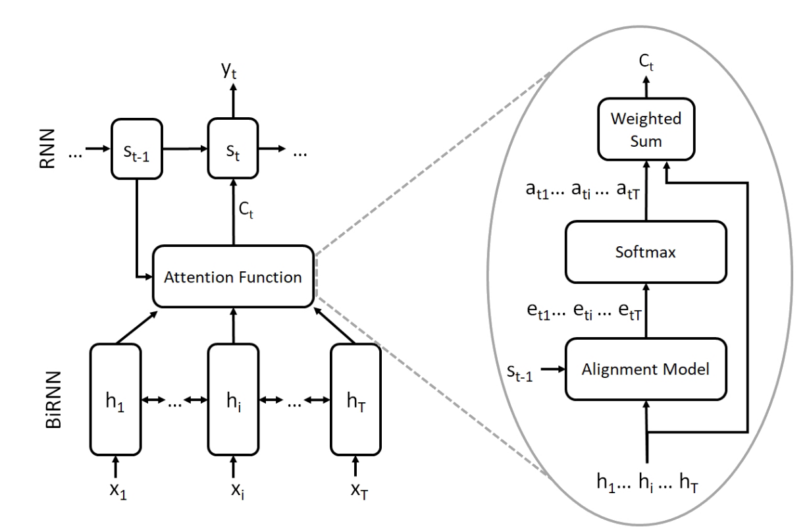

## 注意力机制的本质

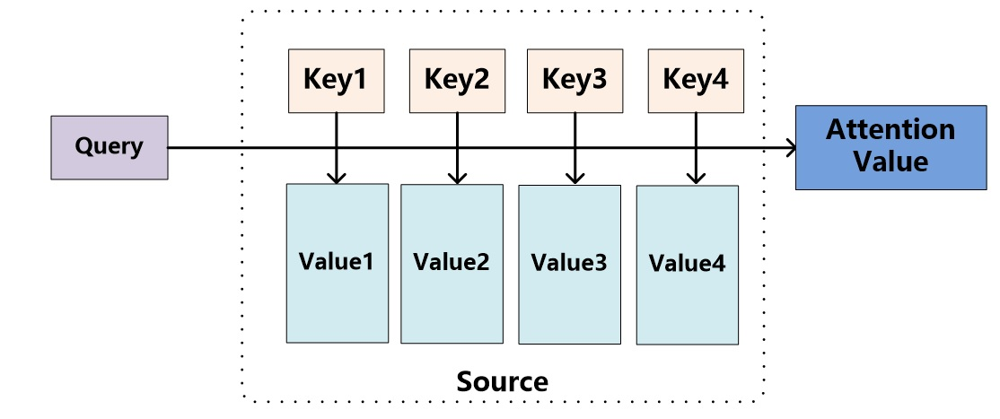

An attention function can be described as mapping a query and a set of key-value pairs to an output, where the query, keys, values, and output are all vectors. The output is computed as a weighted sum of the values, where the weight assigned to each value is computed by a compatibility function of the query with the corresponding key.

**Attention机制的本质：**将Source中的构成元素想象成是由一系列的数据对 $$<key,value>$$ 构成，此时给定Target中的某个元素Query，通过计算Query和各个Key的**相似性或者相关性**，得到每个Key对应Value的权重系数，然后对Value进行加权求和，即得到了最终的Attention数值。所以本质上Attention机制是对Source中元素的Value值进行加权求和，而Query和Key用来计算对应Value的权重系数。即可以将其本质思想改写为如下公式： 

$$Attention(Query,Source)=\sum_{i=1}^{l}S(Query,Key_i)*Value_i$$ 

Attention的具体计算过程如下：

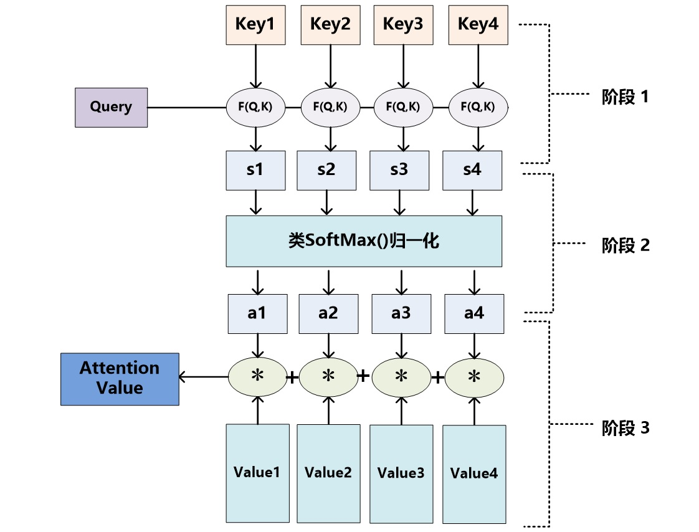

1. 根据Query和Key计算两者相似性或者相关性分数： $$\mathbf{e}=f(\mathbf{q},\mathbf{K})$$; 
2. 对第一步得到的原始分数进行归一化处理，得到Key对应Value的权重系数：$$\mathbf{\alpha}= softmax(\mathbf{e})$$ ；
3. 根据权重系数对Value进行加权求和： $$\mathbf{c}=\sum_{i=1}^{l}\alpha_i\mathbf{V}_i$$ 。

### 1，通用的注意力模型

**通过注意力机制的本质其实我们可以得到一个通用的注意力模型**：

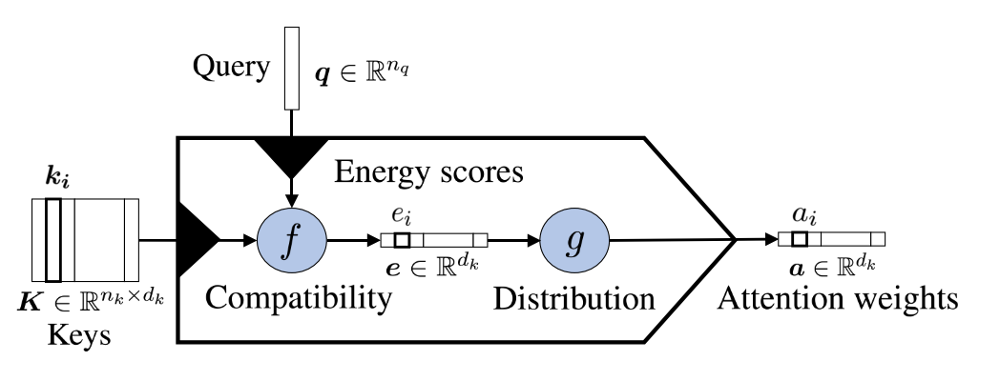

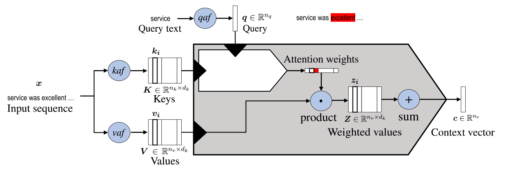

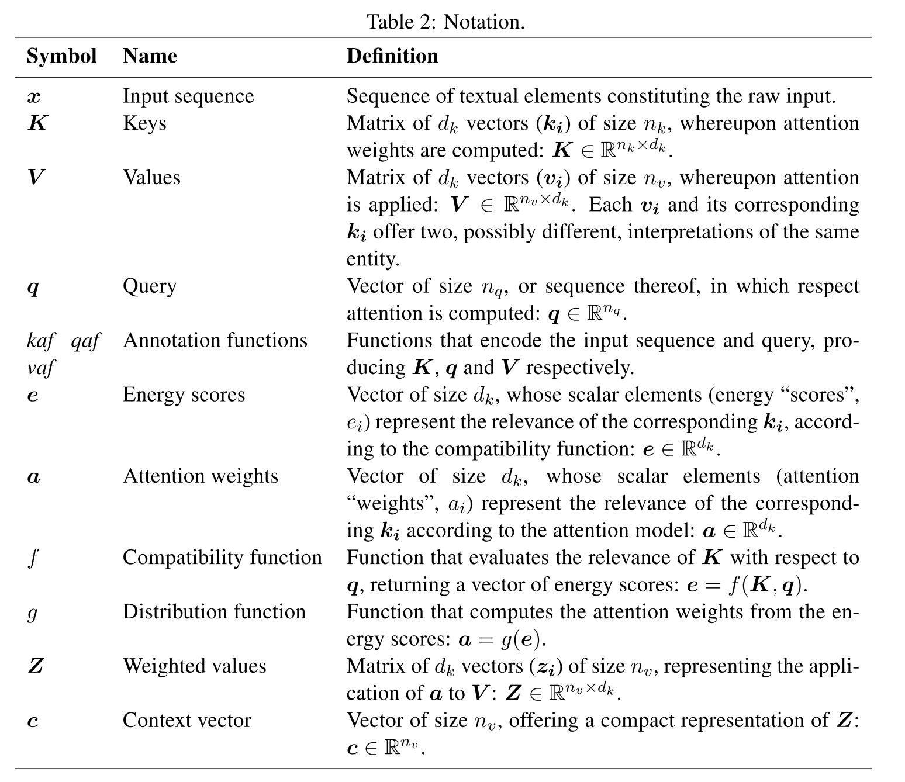

需要注意的是一般需要将Input sequence和Query text进行一下变换得到真正的**Keys、Values和Query**，再进行相应的操作！图中的kaf、vaf和qaf就是对应的转换函数\(annotation function\)。Compatibility function就是第一步的相似性或相关性打分函数。

**Keys**可以是文档中的词嵌入或字符嵌入、RNN的隐状态甚至可以是一个相同对象的多重表示\(例如同一个词的one-hot encoding和 word embedding\)；**Query q**通常被作为计算注意力分布的参考，如果定义了**q**，那么注意力机制会根据任务分配给与**q**相关度较高的**key**较高的权重；如果没有定义**q**，那么注意力机制考虑任务固有的相关性来分配权重。例如在NMT中，q没有被定义，我们就是用Decoder中RNN的每一个时刻的internal state $$s_i$$作为q；而在一起其他任务中，q可以是真实文本查询的嵌入、上下文信息或者是背景知识等，q可以是一个vector也可以是多个vector。

### 2，注意力的用处

注意力使得能够估计输入元素的相关性以及将所述元素组合成紧凑表示：context vecor，其浓缩了最相关元素的特征，相比于原始输入，它参数少了很多，减少了计算资源的消耗。

* 对于文本分类，只有**K**而没有**q**，此时注意力机制可以看作是将输入编码为紧凑形式的工具;
* 对于文本序列生成任务，如机器翻译，注意力机制可以充分利用输入序列的动态表示，而不用将输入序列只编码为一个单一表示，即它可以生成一个元素上下文依赖的表示；
* 对于依存解析或问答，注意力机制\(self attention\)被当做选择特定单词的工具；
* 最后，当必须结合考虑多个相互作用的输入序列时，注意力\(co-attention\)可以派上用场。例如问答任务。

### 3，注意力机制的各个部分

**3.1** **Scoring function**

在第一阶段计算Query和Key的**相似性或者相关性分数**的时候，可以引入不同的函数和计算机制。如下图所示：

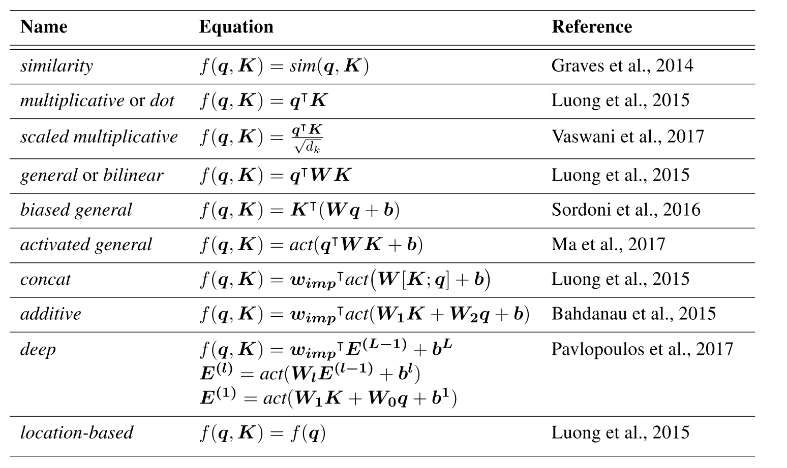

表中最后一个attention distribution只依赖于query，这个被称为location-based attention；如果attention distribution只依赖于Keys，那么就被称为self attention或者intra attention。

#### 3.2 Distribution function

**Hard attention：**只能是0或者1。

**Soft attention：**

* sigmiod
* softmax
* 或者其他

**Hard attention 和Soft attention的结合：**一些噪声元素的attention weight最好为0，然后剩余的元素使用Soft attention。

## 注意力机制的种类

### 1，单重注意力

* **self attention**

上表中最后一个attention distribution只依赖于query，这个被称为**location-based attention**；如果attention distribution只依赖于Keys，那么就被称为**self attention或者intra attention**。如下图所示：

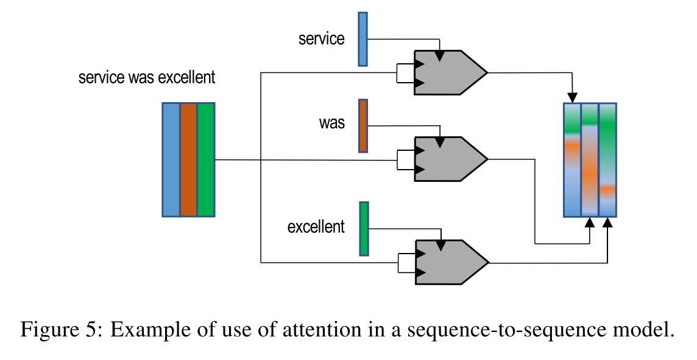

* **Hierarchical input architectures**（左：Hierarchical Attention，中右：attention via attention）

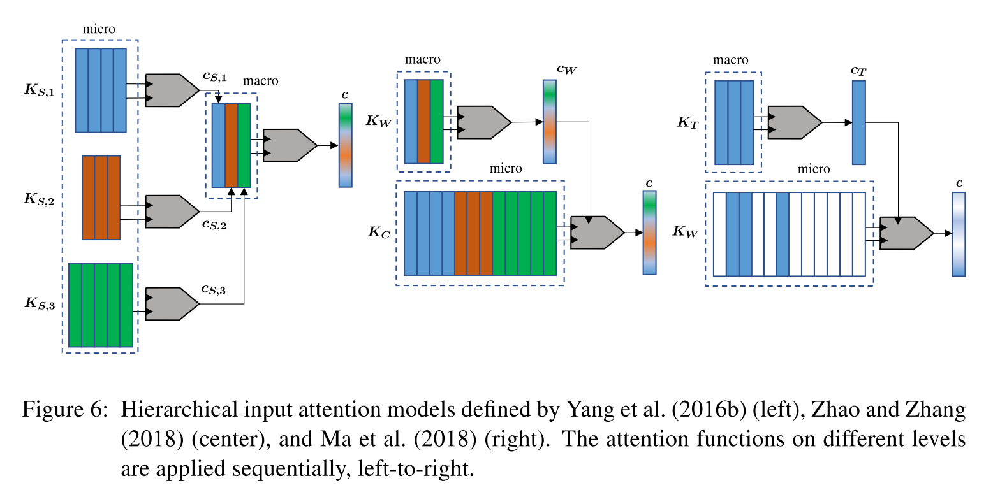

* **memory-based attention**

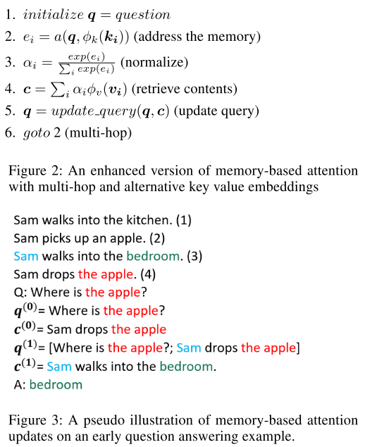

### 2，多重注意力

#### 2.1 多个输出

当数据存在模糊性时，数据应该以多种方式解释。例如当一个词有多种含义或解决多任务问题时。此时，应该在相同数据上计算**多个注意力分布**。主要有以下两种方式：

* **multi-dimentional attention**

它将additive attention中的importance vector替换为importance matrix,每一个key都与q有多个相关性分数，这样最终就可以得到包含多个注意力分布向量的矩阵，最终可以得到一个context matrix，然后对context matrix进行view-wise的concat，就可以得到特征更加丰富的context vector。

* **multi-head attention**

根据可学习的参数执行所有输入（K，V，q）的**多个线性投影**，并且并行计算多个注意力分布向量，然后将处理后的多个context vectors合并为单个context vector。

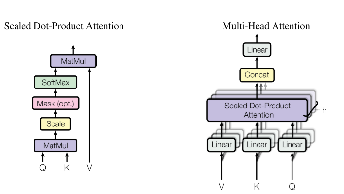

$$Attention(Q,K,V) = softmax(\frac{QK^T}{\sqrt{d_k}})V$$ 

#### 2.2 多个输入：co-attention

这种情况就是Query不再是一个query vector,而是有很多q，组成了一个query matrix。粗粒度模型使用另一个输入变换为一个query vector来计算每个输入的注意力。 细粒度模型考虑输入的每个元素相对于另一个输入的每个元素。 此外，可以顺序地或并行地执行co-attention。 在并行模型中，对称地计算K和Q的注意力分布，因此两个输入被相同地对待。 

* **粗粒度的co-attention**

粗粒度的co-attention使用一个输入的紧凑表示来计算在另一个输入的注意力分布。

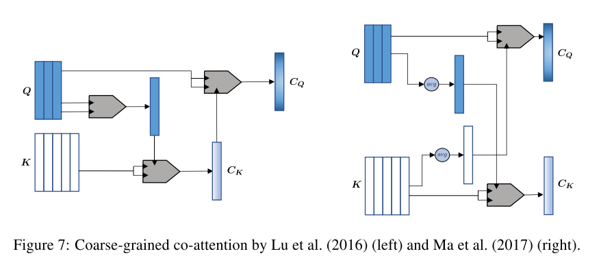

上图左边是交替co-attention，右边是并行co-attention。

* **细粒度的co-attention**

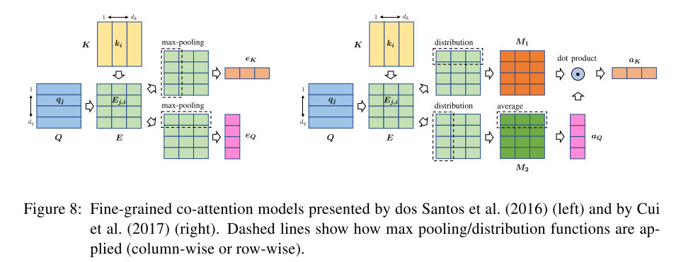

**通过组合多个co-attention模型的结果可以获得进一步的改进。例如，并行计算粗粒度和细粒度的co-attention，并将结果组合成单个嵌入。**

### 

