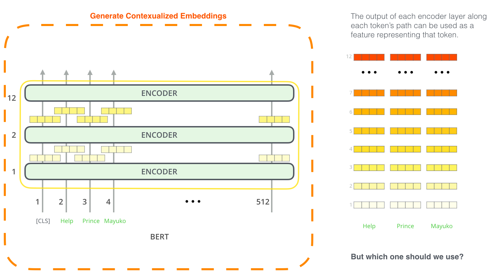

# Bert

## Bert的模型结构

**Bert采用和GPT完全相同的两阶段模型，首先是语言模型预训练；其次是使用Fine-Tuning模式解决下游任务。**和GPT的最主要不同在于在预训练阶段采用了类似ELMO的双向语言模型，当然另外一点是语言模型的数据规模要比GPT大。所以这里Bert的预训练过程不必多讲了。

**第二阶段，Fine-Tuning阶段如下图所示，这个阶段的做法和GPT是一样的。**当然，它也面临着下游任务网络结构改造的问题，在改造任务方面Bert和GPT有些不同。

**NLP的四大类问题：**

* **序列标注：**最典型的NLP任务，比如中文分词，词性标注，命名实体识别，语义角色标注等都可以归入这一类问题，**它的特点是句子中每个单词要求模型根据上下文都要给出一个分类类别。**
* **分类任务：**文本分类，情感计算等都可以归入这一类。它的特点是不管文章有多长，总体给出一个分类类别即可。
* **句子关系判断：**比如Entailment，QA，语义改写，自然语言推理等任务都是这个模式，它的特点是给定两个句子，模型判断出两个句子是否具备某种语义关系；
* **生成式任务：**比如机器翻译，文本摘要，写诗造句，看图说话等都属于这一类。它的特点是输入文本内容后，需要自主生成另外一段文字。

说这个是为了**强调Bert的普适性有多强。**

Bert如何改造输入输出部分使得大部分NLP任务都可以使用Bert预训练好的模型参数呢？如下图所示：

改造方法如下：

* **句子关系判断：**很简单，和GPT类似，加上一个起始和终结符号，句子之间加个分隔符即可。对于输出来说，把第一个起始符号对应的Transformer最后一层位置上面串接一个softmax分类层即可。
* **分类任务：**与GPT一样，只需要增加起始和终结符号，输出部分和句子关系判断任务类似改造；
* **序列标注问题：**输入部分和单句分类是一样的，只需要输出部分Transformer最后一层每个单词对应位置都进行分类即可。

尽管Bert论文没有提，但是稍微动动脑子就可以想到，其实对于机器翻译或者文本摘要，聊天机器人这种生成式任务，同样可以稍作改造即可引入Bert的预训练成果。只需要附着在S2S结构上，encoder部分是个深度Transformer结构，decoder部分也是个深度Transformer结构。根据任务选择不同的预训练数据初始化encoder和decoder即可。这是相当直观的一种改造方法。当然，也可以更简单一点，比如直接在单个Transformer结构上加装隐层产生输出也是可以的。**不论如何，从这里可以看出，NLP四大类任务都可以比较方便地改造成Bert能够接受的方式。这其实是Bert的非常大的优点，这意味着它几乎可以做任何NLP的下游任务，具备普适性，这是很强的。**

**效果如下：**

**在11个各种类型的NLP任务中达到目前最好的效果，某些任务性能有极大的提升。一个新模型好不好，效果才是王道。**

到这里我们可以再梳理下几个模型之间的演进关系。从上图可见，Bert其实和ELMO及GPT存在千丝万缕的关系，比如如果我们把GPT预训练阶段换成双向语言模型，那么就得到了Bert；而如果我们把ELMO的特征抽取器换成Transformer，那么我们也会得到Bert。所以你可以看出：**Bert最关键两点，一点是特征抽取器采用Transformer；第二点是预训练的时候采用双向语言模型。**前面提到了CBOW方法，它的核心思想是：在做语言模型任务的时候，我把要预测的单词抠掉，然后根据它的上文Context-Before和下文Context-after去预测单词。其实Bert怎么做的？Bert就是这么做的。**Bert本身的效果好和普适性强才是最大的亮点。**

## **Bert的预训练详解**

**Bert最大的创新其实在预训练阶段，它采用了Masked LM和Next sentence prediction两个任务来一起进行预训练！**

### **1，Masked LM**

Masked双向语言模型向上图展示这么做：**随机选择语料中15%的单词，把它抠掉，也就是用\[Mask\]掩码代替原始单词，然后要求模型去正确预测被抠掉的单词。**但是这里有个问题：**训练过程大量看到\[mask\]标记，但是真正后面用的时候是不会有这个标记的，这会引导模型认为输出是针对\[mask\]这个标记的，但是实际使用又见不到这个标记，这自然会有问题。为了避免这个问题，Bert改造了一下，15%的被上天选中要执行\[mask\]替身这项光荣任务的单词中：**

* **只有80%真正被替换成\[mask\]标记；**
* **10%被狸猫换太子随机替换成另外一个单词（这种random替换其实本质上属于language modeling里面基于interpolation的平滑方式！！！）**
* **10%情况这个单词还待在原地不做改动。**

**这就是Masked双向语音模型的具体做法。**

对于要做 mask，这个原因上面已经分析了，就是为了解决双向机制的泄密问题而设计的；**而为什么还要有一部分概率不做真正的 mask，而是输入一个实际的词，这样做的好处是尽量让训练和 finetune 时输入保持一致，因为 finetune 输入中是没有“\[MASK\]”标记的。对于保留为原来的真实词，也就是真的有 10% 的情况下是泄密的（占所有词的比例为 15% \* 10% = 1.5%），作者说这样能够给模型一定的 bias，相当于是额外的奖励，将模型对于词的表征能拉向词的真实表征。**

> 笔者个人理解是：因为输入层是待预测词的真实 embedding，在输出层中的该词位置得到的 embedding，是经过层层 Self-attention 后得到的，这部分 embedding 里肯定多少保留有部分输入 embedding 的信息，而这部分的多少就是通过输入一定比例真实词所带来的额外奖励，最终会使得模型的输出向量朝输入层的真实 embedding 有一个偏移。**如果全用 mask 的话，模型只需保证输出层的分类准确，对于输出层的向量表征并不关心，因此可能会导致最终的向量输出效果并不好。**
>
> 最后，BERT 对选中的词在 10% 概率下不做 mask，而是被随机替换成为一个其他词，这样做的目的，BERT 也给出了他们的解释：**因为模型不知道哪些词是被 mask 的，哪些词是 mask 了之后又被替换成了一个其他的词，这会迫使模型尽量在每一个词上都学习到一个全局语境下的表征，因而也能让 BERT 获得更好的语境相关的词向量**（这正是解决一词多义的最重要特性）。
>
> _Jocab原文如下：_
>
> _The Transformer encoder does not know which words it will be asked to predict or which have been replaced by random words, so it is forced to keep a distributional contextual representation of every input token._

### **2，Next sentence prediction**

**Next sentence prediction是预训练的第二个任务，借鉴了 Skip-thoughts 方法中的句子预测问题，来学习句子级别的语义关系。**做语言模型预训练的时候，分两种情况选择两个句子，一种是选择语料中真正顺序相连的两个句子；另外一种是第二个句子从语料库中抛色子，随机选择一个拼到第一个句子后面。我们要求模型除了做上述的Masked语言模型任务外，附带再做个句子关系预测，判断第二个句子是不是真的是第一个句子的后续句子。训练的时候，数据中有 50% 的情况这两个句子是先后关系，而另外 50% 的情况下，这两个句子是随机从语料中凑到一起的，也就是不具备先后关系，以此来构造训练数据。**句子级别的预测思路和之前介绍的 Skip-thoughts 基本一致，当然更本质的思想来源还是来自于 word2vec 中的 skip-gram 模型。之所以这么做，是考虑到很多NLP任务是句子关系判断任务，单词预测粒度的训练到不了句子关系这个层级，增加这个任务有助于下游句子关系判断任务。所以可以看到，它的预训练是个多任务过程。这也是Bert的一个创新。**

### **3，预训练的输入和输出**

Bert的输入部分，也算是有些特色。它的输入部分是个线性序列，两个句子通过分隔符分割，最前面和最后增加两个标识符号。**每个单词有三个embedding：**

* 位置信息embedding，这是因为NLP中单词顺序是很重要的特征，需要在这里对位置信息进行编码；
* 单词embedding,这个就是我们之前一直提到的单词embedding；
* 句子embedding，因为前面提到训练数据都是由两个句子构成的，那么每个句子有个句子整体的embedding项对应给每个单词。

**把单词对应的三个embedding叠加，就形成了Bert的输入。**

**训练数据形式如下：**

**输出部分：**

**激活函数：Gelu\(**Gaussian error linear units\)**，在多个任务上，效果优于Relu。**

### 4，Bert有效因子分析

跟GPT相比，双向语言模型起到了最主要的作用，对于那些需要看到下文的任务来说尤其如此。而预测下个句子来说对整体性能来说影响不算太大，跟具体任务关联度比较高。

## Bert-特征提取器

The fine-tuning approach isn’t the only way to use BERT. **Just like ELMo, you can use the pre-trained BERT to create contextualized word embeddings.** Then you can feed these embeddings to your existing model – a process the paper shows yield results not far behind fine-tuning BERT on a task such as named-entity recognition.

Which vector works best as a contextualized embedding? I would think it depends on the task. The paper examines six choices \(Compared to the fine-tuned model which achieved a score of 96.4\):

## 总结

### 1，Bert的评价与意义

**两阶段模型：**

* **超大规模预训练+具体任务FineTuning\(两阶段模型结构需相近\)**
* **超大规模预训练+具体任务特征补充\(两阶段模型结构可以不同\)**

**BERT 最主要的几个特征分别是：**

* Transformer Encoder 因为有 Self-attention 机制，BERT 自带双向功能；
* 因为双向功能以及多层 Self-attention 机制的影响，使得 BERT 必须使用 Cloze 版的语言模型 Masked-LM 来完成 token 级别的预训练；
* 为了获取比词更高级别的句子级别语义表征，BERT 加入了 Next Sentence Prediction 来和 Masked-LM 一起做联合训练；
* 为了适配多任务下的迁移学习，BERT 设计了更通用的输入层和输出层。

### 2，再次强调NLP预训练本质

**本质上预训练是通过设计好一个网络结构来做语言模型任务，然后把大量甚至是无穷尽的无标注的自然语言文本利用起来，预训练任务把大量语言学知识抽取出来编码到网络结构中，当手头任务带有标注信息的数据有限时，这些先验的语言学特征当然会对手头任务有极大的特征补充作用，因为当数据有限的时候，很多语言学现象是覆盖不到的，泛化能力就弱，集成尽量通用的语言学知识自然会加强模型的泛化能力。**如何引入先验的语言学知识其实一直是NLP尤其是深度学习场景下的NLP的主要目标之一，不过一直没有太好的解决办法，而ELMO/GPT/Bert的这种两阶段模式看起来无疑是解决这个问题自然又简洁的方法，这也是这些方法的主要价值所在。

### 3，当前NLP发展方向

对于当前NLP的发展方向，我个人觉得有两点非常重要：

* 一个是需要**更强的特征抽取器**，目前看Transformer会逐渐担当大任，但是肯定还是不够强的，需要发展更强的特征抽取器；
* 第二个就是如何**优雅地引入大量无监督数据中包含的语言学知识**，注意我这里强调地是优雅，而不是引入，此前相当多的工作试图做各种语言学知识的嫁接或者引入，但是很多方法看着让人牙疼，就是我说的不优雅。**目前看预训练这种两阶段方法还是很有效的，也非常简洁**，当然后面肯定还会有更好的模型出现。

Bert和ELMo、GPT的比较可以看：



