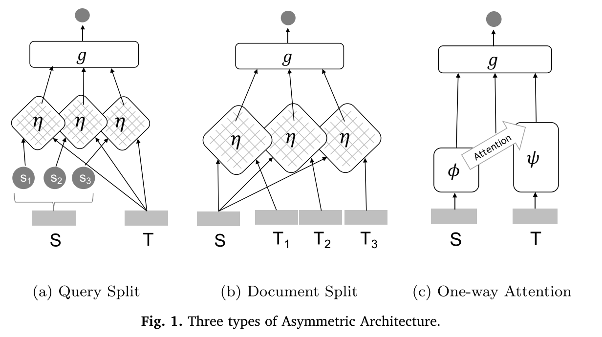
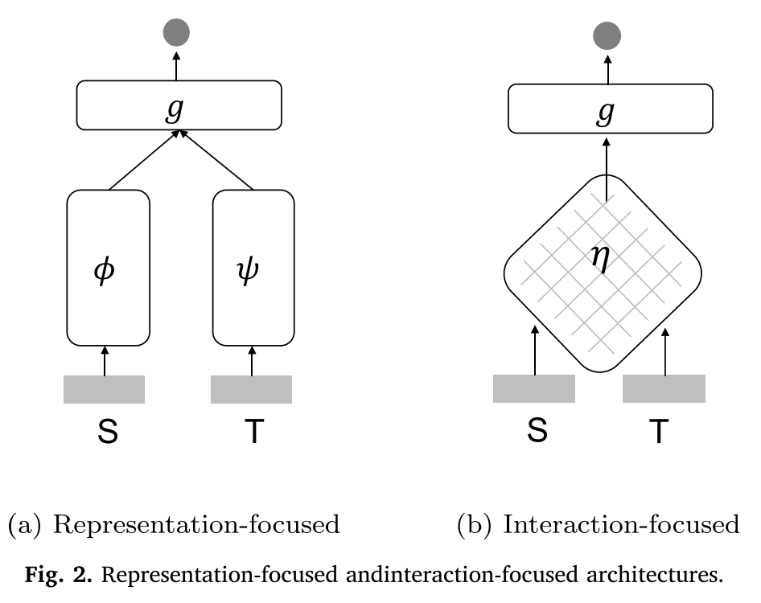
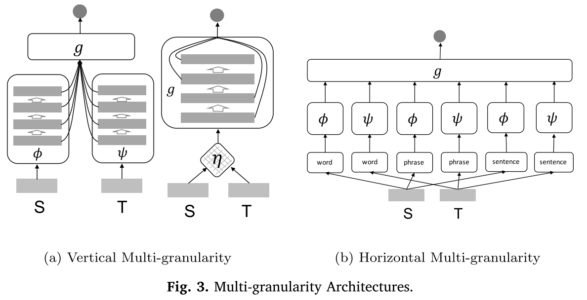

# 《A Deep Look into neural ranking models for information retrieval》笔记

## 1. 引言

排序模型发展历程：

* 向量空间模型
* 概率模型
* LTR\(Learning To Rank\)模型
* NRM\(Neural Ranking Model\)

NRM的现有问题：

* NRM仍然未能达到像ASR、CV的水平；
* 对NRM设计原则的理解比较少；
* 还没有发现超越传统IR模型的NRM的特殊功能。

之前综述不同，我们的综述不会覆盖NIR的每一个方面，而是主要关注和深入了解NRM，了解它们的：

* 底层假设
* 设计原则
* 学习策略

## 2. NRM的主要应用

### Ad-hoc检索

**Ad-hoc检索：**它是一种经典检索任务，用户通过一个query指定他的信息需求来搜索可能相关的文档。ad-hoc术语是指这样一种情景：集合中的文档相对**保持静态**，而新的查询不断提交给系统。

**ad-hoc检索任务的主要特点：query和document是异质的，query很短而document很长**。这种异质性导致了严重的**词汇不匹配问题**。**语义匹配**可以缓解这一问题，但**精确匹配**对于包含罕见词的匹配又是必不可少的。

ad-hoc检索中的**相关性概念**天生就含糊不清，并且**高度依赖用户**，这使得**相关性评估**成为一个非常具有挑战性的问题。

**相关数据集**：

* Robust
* GlueWeb
* GOV2
* Microblog
* AOL log
* Bing Search log
* NTCIR WWW Task

### 问答

**QA：**基于一些信息资源尝试用自然语言自动回答用户提出的问题。信息资源可以是结构化的（如知识库），也可以是非结构化的（如文档、网页等）。

QA有多种任务形式：

* 多项选择（分类问题）
* 答案段落/句子检索（检索问题）
* 答案区间定位（机器阅读理解问题）
* 多种来源的答案整合

本综述中主要解决QA的**答案段落/句子检索（检索问题）**。

和Ad-hoc retrieval相比，**QA的问题和答案是同质的**，长度和主题都是一致的，没有太大的不同。

而且QA的**相关性概念**相对清晰，即目标段落/句子是否回答了问题，但**评估**却极具挑战性。

**相关数据集**：

* TREC QA
* WikiQA
* WebAP
* InsuranceQA
* WikiPassageQA
* MS MARCO

### 社区问答

**CQA**旨在根据CQA网站中现有的QA资源来找到用户问题的答案，例如Quora、Stack Overflow和知乎等。

作为检索任务，CQA的任务形式可以分为两类：

* 直接从答案池中检索答案；
* 从问题池中检索出相似的问题：相似问题的答案是一样的，所以可以用旧问题的答案回答相似的新问题。

本综述只要关注第二种任务形式。

**CQA输入的两个问题也是同质的，CQA中的相关性概念也十分清楚，是指语义对等/相似。**

**相关数据集：**

* Quora Dataset
* Yahoo! Answers Dataset
* SemEval-2017 Task3
* CQADupStack
* ComQA
* LinkSO

### 自动对话

**AC**旨在创建自动人机对话过程，以回答问题，完成任务和社交聊天（即聊天）。

AC任务形式分为：

* 检索任务：从对话存储库中排名/选择合适的回复；
* 生成任务：对应输入的对话，生成合适的回复。

本综述主要关注检索任务形式。

AC中的相关性是指定义广泛的某些语义对应关系（或连贯结构）。一个好的回复并不需要单词之间的语义匹配，取而代之的是，对对应/连贯建模并避免普遍的琐碎回复至关重要。

**相关数据集**：

* Ubuntu Dialog Corpus \(UDC）
* Sina Weibo dataset
* MSDialog
* NTCIR STC

## 3. 统一的模型形式

$$\mathcal{S}$$：广义的query集合；

 $$\mathcal{T}$$ ：广义的document集合；

$$\mathcal{Y}$$ ：标签集合；

查询 $$s_i$$ _的相关文档集合为_ $$T_i=\{t_{i,1},t_{i,2},...,t_{i,ni}\}$$ _，对应标签为_ $$y_i=\{y_{i,1},y_{i,2},...,y_{i,n_i}\}$$ 。

因此，广义的LTR问题是通过最小化一个标记数据集的损失函数来找到最佳排序函数 $$f^{\star}$$ ：

$$
f^{\star} = \arg \min \sum_i\sum_jL(f;s_i,t_{ij},y_{ij})
$$

排序函数f为：

$$
f(s, t)=g(\psi(s), \phi(t), \eta(s, t))
$$

其中s,t是两个输入文本， $$\psi$$ 是从s抽取特征的表示函数， $$\phi$$ 是从t抽取特征的表示函数， $$\eta$$ 是从\(s,t\)对抽取特征的交互函数，g是基于这些特征计算相关度得分的评估函数。

例如，传统的LTR方法的 $$\psi、\phi和\eta$$ 都是固定函数（人工定义的特征函数），而评估函数g可以是任何一个机器学习模型，如LogisticRegression、GBDT等，可以从训练数据中学到。**而对于NRM来说，** $$\psi、\phi、\eta和g$$ **都是一个神经网络结构，都可以从训练数据中学习出来。**

## 4. 模型架构

### 4.1 对称架构 vs 非对称架构

根据输入文本s和t的不同底层假设可以将NRM的模型结构分为对称架构和非对称架构。

#### （1）对称架构

当输入s和t假设是同质的，那么就可以应用对称网络结构。

**对称结构意味着s和t可以在输入层交换位置而不影响最终的输出。**

对称网络包括：

* 孪生网络
  * DSSM\(2013\)
  * CLSM\(2014\)
  * LSTM-RNN\(2016\)
* 对称交互网络
  * DeepMatch\(2013\)
  * Arc-II\(2014\)
  * MatchPyramid\(2016\)
  * Match-SRNN\(2016\)

**对称架构适用情况：**由于对称架构底层假设输入的s和t是同质的，所以很适用于CQA和AC，因为它们的s和t有着相似的长度和形式。它也适用于一些ad-hoc检索任务或者QA，当只使用文档标题/snipets或者比较短的回答，因为这样可以减轻s和t的异质性。

#### （2）非对称架构

当输入s和t假设是异质的，那么就可以应用非对称网络结构，**主要应用于ad-hoc检索任务中。**

在非对称架构中有**三种策略**来解决query和document的异质性问题：

* Query split：基于大多数query都是基于keyword的假设。
  * DRMM\(2016\)
  * K-NRM\(2017\)
* Document split：基于只要document的部分与query相关就是可以的假设。
  * HiNT\(2018\)
* Joint split：联合以上两种假设。
  * DeepRank\(2017\)
  * PACRR\(2017\)
* One-way attention
  * IARNN\(2016\)
  * CompAgg\(2017\)

### 4.2 表示型架构 vs 交互型架构

根据怎样抽取特征（只通过表示函数 $$\psi$$ 和 $$\phi$$ 抽取 or 只通过交互函数抽取 $$\eta$$ ）来进行相关性评估，可以NRM的模型架构分为表示型架构和交互型架构。

#### （1）表示型架构

表示型架构需要复杂的 $$\psi$$ 和 $$\phi$$ ，而g可以很简单。

可以按表示网络的类型可以分为三类：

* FFN-based
  * DSSM\(2013\)
* CNN-based
  * ARC-I\(2014\)
  * CNTN\(2015\)
  * CLSM\(2014\)
* RNN-based
  * LSTM-RNN\(2016\)
  * MV-LSTM\(2016\)

**表示型架构适用情况：**表示型架构可以更好地满足全局匹配需求，十分适合短文本的输入任务，例如CQA和AC。

表示型架构在线计算很高效，因为它可以提前计算出输入文本的表示。

#### （2）交互型架构

交互型架构直接建模 $$\eta$$ ，而且需要十分复杂的g。

按交互函数可以分为两类：

* 无参数交互函数型

  这类方法里的交互函数一般为：

  * 指示函数
  * cos函数
  * 点积函数
  * 径向基函数
  * 其他：一个词和一个词向量集合的函数，例如DRMM和K-NRM

* 有参数交互函数型

  直接从数据中学习相似度函数。

  * ARC-II
  * Match-SRNN
  * Bert-base model

**交互型架构优点：**通过使用详细的交互信号而不是单个文本的高级表示，交互型架构可以更适合需要特定匹配模式（例如，精确的单词匹配）和多样化匹配（例如，ad-hoc检索）要求的任务。交互型架构也更适合异质输入，例如ad-hoc检索 和QA，因为它们规避了编码长文本的困难。因此，一种实用的更好方法是在早期搜索阶段应用表示型模型，而在以后可以应用交互型模型。

#### （3）混合架构

两种结合策略：

* 组合策略：简单地将表示型模型和交互型模型作为整个模型的子模型，然后组合它们各自的最终输入来进行最终的相关性评估。例如：
  * DUET\(2017\)
* 耦合策略：基于attention，在内部就进行组合。
  * IARNN\(2016\)
  * CompAgg\(2017\)

### 4.3 单粒度型架构 vs 多粒度型架构

根据对相关度的评估过程的不同假设，我们可以将NRM的模型架构分为单粒度型架构和多粒度型架构。

#### （1）单粒度型架构

输入s和t仅被视为词序列，而没有使用任何其他语言单元结构。

Many neural ranking models fall in this category, with either symmetric \(e.g., DSSM and MatchPyramid\) or asymmetric \(e.g., DRMM and HiNT\) architectures, either representation-focused \(e.g., ARC-I and MV-LSTM\) or interaction-focused \(e.g., K-NRM and Match-SRNN\).

#### （2）多粒度型架构

在进行相关性评估时用到了输入的多粒度的特征：

* 不同层次的抽象特征
* 不同类型的语言单元

依据此可以将其分为两种多粒度型架构：

* 垂直多粒度型
  * MultiGranCNN\(2015\)
  * MACM\(2018\)
  * MultiMatch\(2018\)
  * MP-HCNN\(2019\)
* 水平多粒度型
  * Conv-KNRM\(2018\)
  * MIX\(2018\)

**多粒度型架构的好处：**如我们所见，多粒度型架构是单粒度型架构的自然扩展，它考虑了固有的语言结构和网络结构，以增强相关性估计。更适合需要细粒度匹配信号的相关性计算，例如ad-hoc检索和QA。

## 5. 模型学习

模型学习主要包括**学习目标**和**训练策略**两块。

### 5.1 学习目标

#### （1）pointwise排序目标

pointwise排序目标的思想是将排序问题简化为了分类或回归问题的集合。

给定query-document pairs $$(s_i,t_{i,j})$$ ，以及它对应的相关度 $$y_{i,j}$$ ，则pointwise排序目标可以形式化为：

$$
L(f ; \mathcal{S}, \mathcal{T}, \mathcal{Y})=\sum_{i} \sum_{j} L\left(y_{i, j}, f\left(s_{i}, t_{i, j}\right)\right)
$$

最常用的还是交叉熵损失函数：

$$
L(f ; \mathcal{S}, \mathcal{T}, \mathcal{Y})=-\sum_{i} \sum_{j} y_{i, j} \log \left(f\left(s_{i}, t_{i, j}\right)\right)+\left(1-y_{i, j}\right) \log \left(1-f\left(s_{i}, t_{i, j}\right)\right)
$$

其中 $$y_{i,j}$$ 可以是binary label也可以是概率值（如点击率）。

**优点：**

* 计算简单
* 模型输出值在实际应用中有真实的意义

**缺点：**

* 在排序任务中不是很有效，没有直接产生最佳文档排序列表

#### （2）pairwise排序目标

pairwise排序目标专注于优化最优化文档之间的相对偏好而不是它们的标签。形式如下：

$$
L(f ; \mathcal{S}, \mathcal{T}, \mathcal{Y})=\sum_{i} \sum_{(j, k)} \sum_{y_{i j}>y_{i, k}} L\left(f\left(s_{i}, t_{i, j}\right)-f\left(s_{i}, t_{i, k}\right)\right)
$$

比较出名的是Hingle loss：

$$
L(f ; \mathcal{S}, \mathcal{T}, \mathcal{Y})=\sum_{i} \sum_{(j, k), y_{i, j}>y_{i, k}} \max \left(0,1-f\left(s_{i}, t_{i, j}\right)+f\left(s_{i}, t_{i, k}\right)\right)
$$

Hingle loss广泛应用于NRM（如DRMM、K-NRM）的训练中。

另一个比较流行的pairwise损失函数为pairwise交叉熵损失函数：

$$
L(f ; \mathcal{S}, \mathcal{T}, \mathcal{Y})=-\sum_{i} \sum_{(j, k), y_{i, j}>y_{i, k}} \log \sigma\left(f\left(s_{i}, t_{i, j}\right)-f\left(s_{i}, t_{i, k}\right)\right)
$$

**优点：**

* 相比pointwise来说，十分有效

**缺点：**

* 最优化pairwise方法中的文档偏好并不能总是改善最终的排序评价指标：
  * 并不能预测所有情况下的文档偏好；
  * 在大多数现存的排序评价指标的计算中，不是所有的文档对都是同等重要的。

#### （3）listwise排序目标

listwise排序目标的思想是构建一个可以直接反应模型排序效果的损失函数。

不是一次比较两个文档，listwise损失函数一下计算出一个query和它对应的候选文档列表的损失。形式如下：

$$
L(f ; \mathcal{S}, \mathcal{T}, \mathcal{Y})=\sum_{i} L\left(\left\{y_{i, j}, f\left(s_{i}, t_{i, j}\right) | t_{i, j} \in \mathcal{T}_{i}\right\}\right)
$$

2008年提出的**listMLE**如下：

$$
L(f ; \mathcal{S}, \mathcal{T}, \mathcal{Y})=\sum_{i} \sum_{j=1}^{\left|\pi_{i}\right|} \log P\left(y_{i, j} | \mathcal{T}_{i}^{(j)}, f\right)
$$

其中：

$$
P\left(y_{i, j} | \mathcal{T}_{i}^{(j)}, f\right)=\frac{\exp \left(f\left(s_{i}, t_{i, j}\right)\right)}{\sum_{k=j}^{\left|\pi_{i}\right|} \exp \left(f\left(s_{i}, t_{i, k}\right)\right)}
$$

但是这个计算量及其巨大，所以之后出现了很多新的listwise排序目标。

如2018年出现的**Attention Rank function**：

$$
\begin{array}{l}
L(f ; S, \mathcal{T}, \mathcal{Y})=-\sum_{i} \sum_{j} P\left(t_{i, j} | \mathcal{Y}_{i}, \mathcal{T}_{i}\right) \log P\left(t_{i, j} | f, \mathcal{T}_{i}\right) \\
\text { where： } \\
P\left(t_{i, j} | \mathcal{Y}_{i}, \mathcal{T}_{i}\right)=\frac{\exp \left(y_{i, j}\right)}{\sum_{k=1}^{\left|\mathcal{T}_{i}\right|} \exp \left(y_{i, k}\right)} \\
P\left(t_{i, j} | f i, \mathcal{T}_{i}\right)=\frac{\exp \left(f\left(s_{i}, t_{i, j}\right)\right)}{\sum_{k=1}^{\left|\mathcal{T}_{i}\right|} \exp \left(f\left(s_{i}, t_{i, k}\right)\right)}
\end{array}
$$

当标签$y\_{i,j}$是binary的时候，attention rank function可以简化为一个softmax交叉熵损失函数：

$$
L(f ; \mathcal{S}, \mathcal{T}, \mathcal{y})=-\sum_{i} \sum_{j} y_{i, j} \log \frac{\exp \left(f\left(s_{i}, t_{i, j}\right)\right)}{\sum_{k=1}^{1 \mathcal{T}_{i}} \exp \left(f\left(s_{i}, t_{i, k}\right)\right)}
$$

**优点：**

* listwise排序目标比pairwise排序目标更有效

**缺点：**

* 计算量十分巨大，适合重排序阶段。

#### （4）多任务排序目标

### 5.2 训练策略

* **监督学习**
* **弱监督学习：**弱监督学习是指一种学习策略，其中使用现有的检索模型（例如BM25）自动生成查询文档标签，即使用伪标签的监督学习。
* **半监督学习：**半监督学习是指一种学习策略，该策略利用少量标记的查询文档对和大量未标记的数据。

## 6. 模型对比

### 6.1 在ad-hoc检索上的实验对比

* 传统的BM25、RM3、RankSVM、LambdaMart等都是很强的baseline；
* 在ad-hoc检索任务中，非对称型架构、交互型架构和多粒度型架构要比对称型架构、表示型架构和多粒度型架构的效果好。

### 6.2 在QA上的实验对比

* 对称型架构更适合QA；
* 表示型架构更适合短文本答案，而交互型架构更适合长文本答案；
* 随着时间的流逝，性能总体上会提高，这可能是由于模型容量的增加以及某些高级方法的采用所致。

## 7. 趋势方向

* Indexing: From re-ranking to ranking
* Learning with external knowledge
* Learning with visualized technology
* Learning with context
  * Short-term history
  * Long-term history
  * Situational context：Location&time...
  * \(Pseudo-\) relevance feedback
* Neural ranking model understanding

