# 深度文本匹配综述2017

## 引言

文本匹配可以应用于：

* 信息检索：查询项与文档的匹配
* 自动问答：问题和答案的匹配
* 机器翻译：不同语言间的匹配
* 对话系统：上一句和回复的匹配
* 复述问题：同义句的匹配
* 等等

但是每个任务的匹配关注的特性具有很大不同，对于不同的任务可能就需要不同的文本匹配模型。

主要挑战包括：

* 词语匹配的多元性
* 短语匹配的结构性
* 文本匹配的层次性

**深度文本匹配模型可以划分为三类**：

* **基于单语义文档表达的深度学习模型**：首先将单个文本先表达成一个稠密向量 （分布式表达），然后直接计算两个向量间的相似度作为文本间的匹配度；
* **基于多语义文档表达的深度学习模型**：；基于多语义的文档表达的深度学习模型认为单一粒度的向量来表示一段文本不 够精细，需要多语义的建立表达，也就是分别提取 词、短语、句子等不同级别的表达向量，再计算不同 粒度向量间的相似度作为文本间的匹配度；
* **直接建模匹配模式的深度学习模型**：直接建模匹配模式的深度学习模型认为匹配问题需要更精细的建模匹配的模式，也就是需要更早地让两段文本进行交互，然后挖掘文本交互后的模式特征， 综合得到文本间的匹配度。

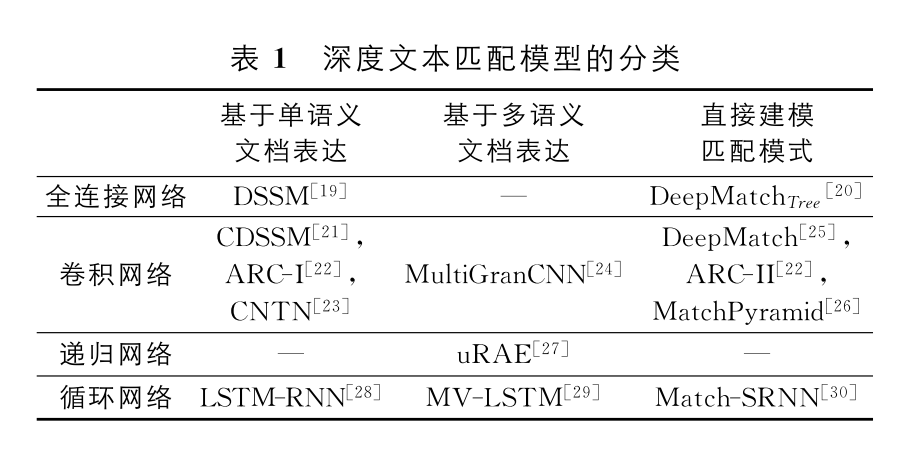

## 文本匹配问题简介

对于一个实际任务，我们通常会抽象成一个排序问题。给定一段文本 $$s_1$$，和另一段文本的一个列表 $${s_2^{(i)}}$$ ，目标是在这个列表中筛选出与给定文本 $$s_1$$匹配的文本。文本匹配模型会计算所有的文本对 $$(s_1,s_2^{(i)})$$的匹配度 $$r^{(i)}，{r^{(i)}}$$列表排序越靠前的文本和 $$s_1$$的匹配度越高。

衡量一个排序结果优劣的评价指标主要包括：

* P@k
* R@k
* MAP
* MRR
* nDCG

其中前四个评价指标是对于匹配的度量都是二值化的情况，而当匹配程度多余两个等级时使用nDCG。

## 基于深度学习的文本匹配学习模型

### 基于单语义文档表达的深度学习模型

将文档表达成一个向量，得到两个文档的向量之后，通过计算这两个向量之间的相似度便可输出两者的匹配度。

有代表性的几个基于单语义文档表达的深度学习模型，主要是在：

1. 构建单个文档表达；
2. 计算表达之间的相似度。

这两个方面进行了研究，这类方法的核心是构建单个文档表达的差异，可以分为以下三类：

* **基于全连接神经网络**

**DSSM \(Deep Structured Semantic Model\)** 是最早将深度模型应用在文本匹配的工作之一，该模型主要针对查询项和文档的匹 配度进行建模，相对于传统文本匹配的模型，该方法有显著的提升。深度语义结构模型是典型的Siamese网络结构，每个文本对象都是由5层的网络单独进行向量化的，最后计算两个文本向量的余弦相似度来决定这两段文本的相似程度。DSSM结构如下图所示：

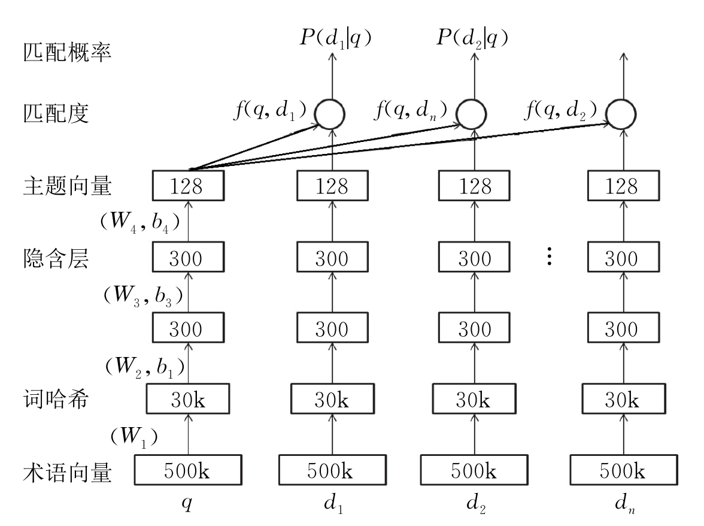

整个模型在 训练的时候使用了大量的搜索系统的点击日志数 据，其中点击的作为正样本，并从没有点击的里面随 机抽样一定量的负样本．然后正负样本组成一组，通 过Softmax函数计算每个文档和查询项的匹配概率（加和为１），然后最大化所有正例的匹配概率的似然函数。

但是基于全连接神经网络的方法没有考虑词序信息。

* **基于卷积神经网络**

微软提出了**CDSSM \(Convolutional Deep Structured Semantic Model\)** ，CDSSM相对于DSSM，将中间生成句子向量的全连接层换成了卷积神经网络的卷积层和池化层，其他部分不变。

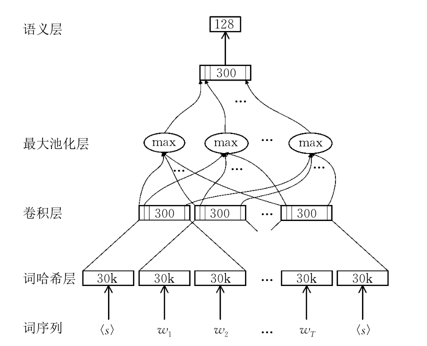

之后华为提出基于TextCNN的**ARC-I**模型，它基于TextCNN直接将两个待匹配的句子表达为两个定长的向量，然后拼接两个向量并输入一个全连接的多层神经网络，从神经网络的输出得到最终的匹配值。

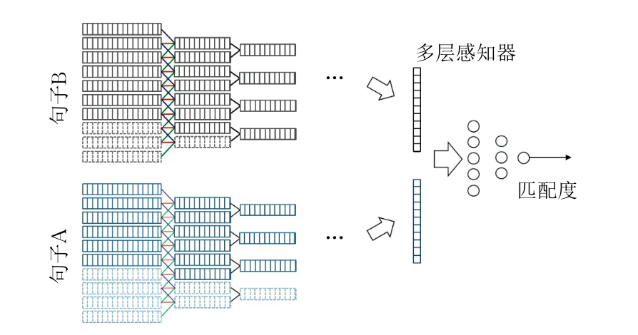

**ARC-I**在训练的时候使用的损失函数与之前的有所不同，它使用的是基于排序的损失函数triplet loss：

$$
L(\Lambda)=\max \left(0,1+f\left(q, d^{-}\right)-f\left(q, d^{+}\right)\right)
$$

旨在拉大正负样本之间的匹配度数值的差距，而并不在意匹配度的绝对值的大小，这个损失函数更接近排序的应用场景。

但是基于卷积神经网络的方法只考虑了局部词序信息。

* **基于循环神经网络**

  **LSTM-RNN**

**小结：**

基于单语义文档表达的深度学习算法的重心在于得到一个适合的文档表达，文本交互函数ｆ定义的比较直接，比如余弦相似度，或者更复杂点的神经张量网络．本节模型 在相似度计算和损失函数定义的贡献，成为了后续 方法借鉴的对象。

优点：

* 便于余弦存储计算好的文档向量；
* 匹配的计算速度快；
* 模型可以用大量无监督的数据进行预训练，尤其是在匹配监督数据很少的时候，用大量文本进行预训练是相当有 效的方法。

因此，该模型非常适合于信息检索这种对存储和速度要求都比较高的任务。

缺点：

* 很多匹配问题不具备传递性（例如问答系统中问题和答案的位置不能互换），因此不适合用一个度量空间（参 数相同的神经网络）来描述；
* 文本的表示学习本身是非常困难的问题，只有效捕捉与描述了对匹配有用的局部化（细节）信息。

### 基于多语义文档表达的深度学习模型

综合考虑文本的局部性表达（词，短语等）和全局性表达（句 子）。这类模型不仅会考虑两段文本最终的表达向 量的相似程度，也会生成局部的短语或者更长的短语的表达进行匹配。这样**多粒度的匹配**可以很好地补充基于单语义文档表达的深度学习模型在压缩整个句子过程中的**信息损失**，而达到更好的效果。

* **uRAE \(unfolding Recursive Auto-Encoder\)**：可伸展递归自动编码器
* **MultiGranCNN**：多粒度卷积神经网络

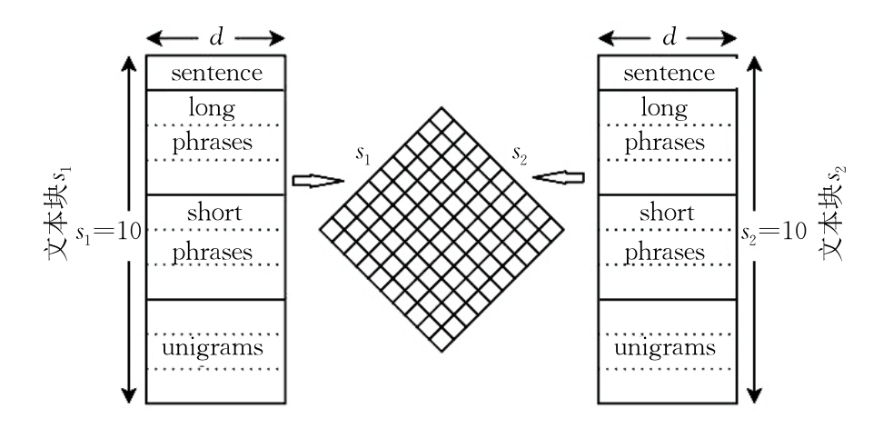

**MultiGranCNN**将1个句子拆解成４个层次：单词级别、短语级别、长短语级别和句子级别，之后将两个句子不同级别的特征进行两两的相似度计算，得到一个相似度矩阵。进行动态最大值池化得到的就是两个句子的相似度得分。

模型通过加入丰富的细节信息，从词、短语和句子３个层次来表示句子，使得句子表示更加丰富，在**复述问题**等任务上取得了很好的效果。

实验表明**长短语级别和短语级别的特征对改述任务十分关键**，而整个句子和单词的特征相比而言就较为弱一些，将所有特征信息拼起来可以得到最好的实验结果。

* **MV-LSTM \(Multi-View LSTM\)**：多视角LSTM模型

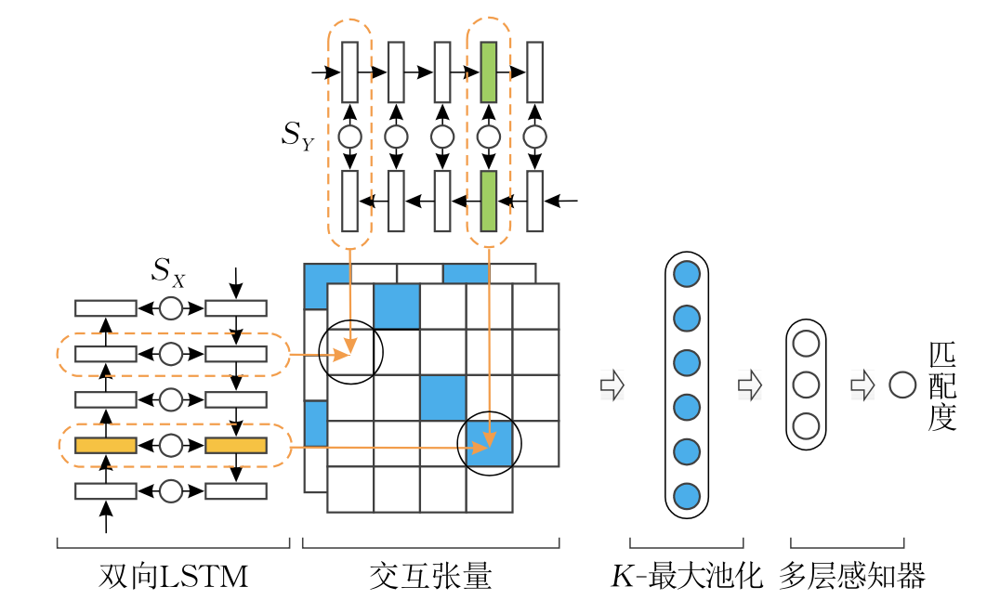

**小结：**

基于多语义的文档表达的深度学习模型和基于单语义文档表达的深度学习模型类似，都是将两个对象分开进行表达，最后再计算两个表达的相似度。 不同的是多语义的文档表达会考虑不同粒度的表达，不仅仅是句子级别的，还有短语和单词级别的表达。优点十分明显，但也有一些缺点：

* 无法区分不同上下文中局部化信息的重要性，在语言多义的挑战下，很难将局部化信息与全局化信息进行有效地整合利用；
* 匹配不仅仅是一元的一一对应，而是有层次、有结构的，分别从两个对象单独提取特征，**很难捕获匹配中的结构信息。**

### 直接建模匹配模式的深度学习模型

区别以关注文本表达（局部化或者全局化）为核心的思路，直接建模匹配模式的深度学习模型**旨在直接捕获匹配的特征：匹配的程度和匹配的结构。**这样更接近匹配问题的本质，也更加契合人们面对两 段文本进行匹配分析的方法．当进行两段文本的匹 配时，我们会先看是不是有匹配的关键词，然后再看关键词之间的相对位置是不是匹配的，最后整合整个句子的意思给两段文本匹配的程度进行打分。实验显示这些模型能在相对复杂的问题上表现更为优秀。

* **DeepMatch**：主题深度匹配模型

  由于主题深度匹配模型用词袋来表示句子，忽略了词在句子中的顺序，它与DSSM一样虽然善于捕捉主题层面上的匹配，但并不适合表达相对更精细的语义。

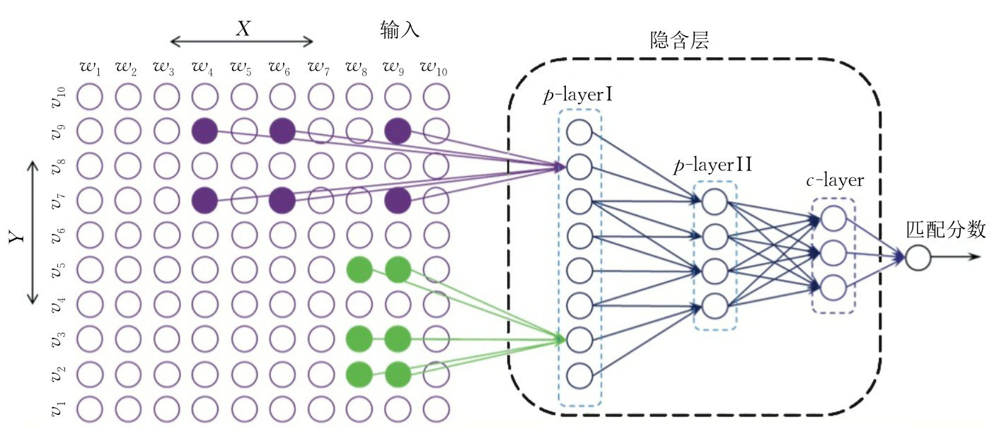

* $DeepMatch\_{tree}$：树深度匹配模型
* **ARC-II**：卷积网络深度匹配模型

  **ARC-II**首先把句子表达成为句中单词的向量序列，然后用滑动窗口来选择词向量组作为基本单元进行卷积操作，得到一个三维的张量，作为两个句子相互作用的一个初步表示．随后的卷积以这个三维张量为基础进行“卷积＋池化”的操作若干次，最后得到一个描述两个句子整体关联的向量，最终由一个多层神经网络来综合合这个向量的每个维度从而得到匹配值。

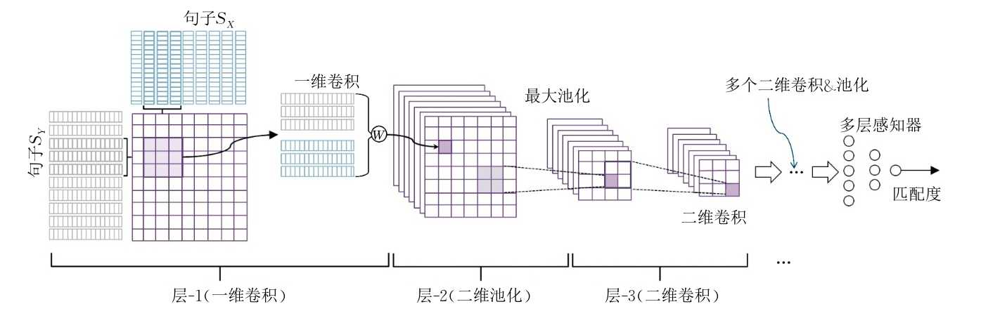

* **MatchPyramid**

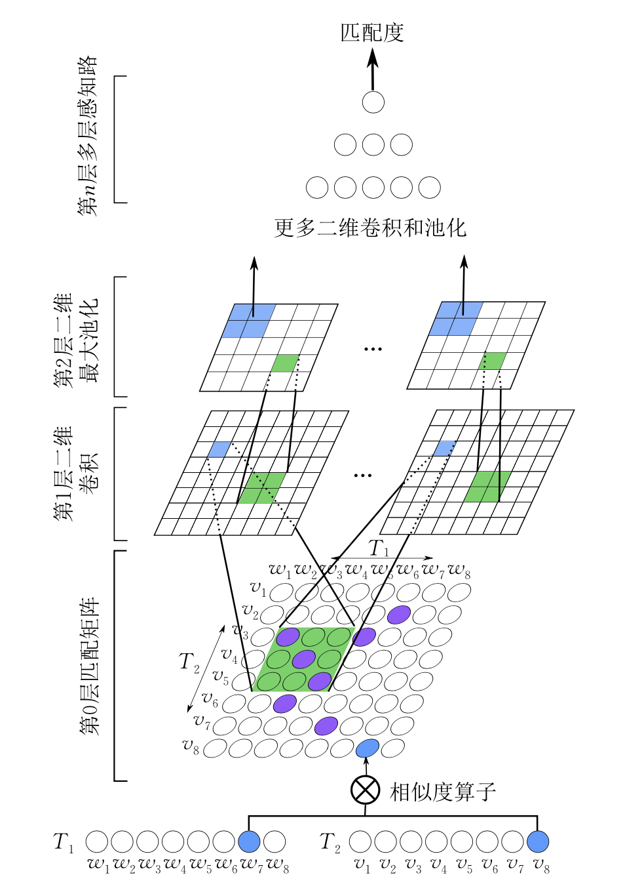

**MatchPyramid**重新定义了两段文本交互的方式**匹配矩阵**：

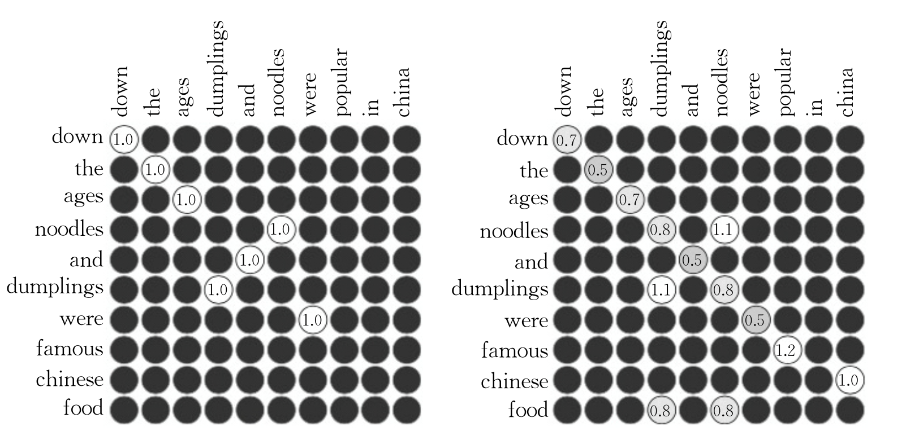

然后基于匹配矩阵这个二维的结构进行二维卷积提取匹配空间的模式，最后通过全连接的网络得到两个句子之间的相似度。模型利用两个词的词向量之间的同或关系、余弦相似度或者点积来定义词之间的相似度，然后句子之间两两词之间都会计算相似度， 根据词在句子中的空间位置刚好可以构建出一个二维的结构，我们称之为匹配矩阵，**匹配矩阵包含了所有最细粒度的匹配的信息。**

* **Match-SRNN**

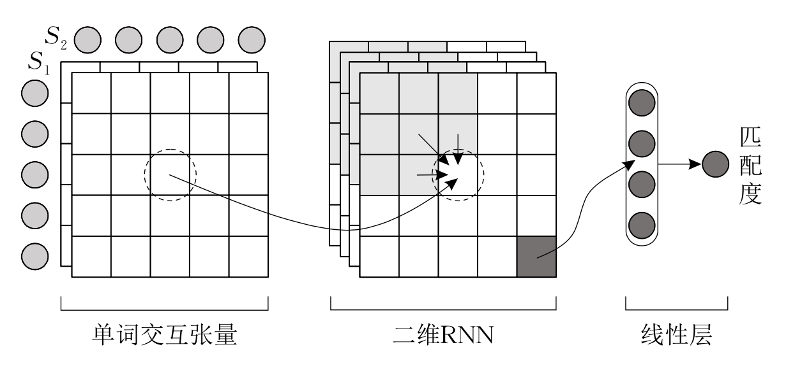

在利用神经张量网络得到匹配矩阵之后，Match-SRNN发现利用二维的循环神经网络来建模特征空间的模式更为合理。尤其是2D-GRU网络能够模拟最长公共子序列的计算过程，最长公共子序列也是快速求解字符串精确子串匹配的动态规划算法。其中：

$$h_{i j}=f\left(h_{i-1, j}, h_{i, j-1}, h_{i-1, j-1}, s\left(w_{i}, v_{j}\right)\right)$$ 

**实验表明，对于结构性明显的数据，例如自动问答数据，该模型有明显的提升**。

**小结：**

优点：

从这类模型的输入开始两段文本就进行了交互，得到细粒度的匹配信息。也就是说在单词级别的表达上直接来构造$M\_0$的，之后基于这个细粒度的匹配做更复杂的变换ｇ和ｈ。和基于单语义文档表达的深度模型相比，**这样的好处在于保持细粒度的匹配信息，避免在一段文本抽象成一个表达时，细节的匹配信息丢失。**

缺点：

* 需要大量的有监督的文本匹配的数据训练，没法通过无监督 的文本进行预训练；
* 预测的时候资源消耗较大， 每一对文档都得完全通过一遍网络，没法像基于单语义文档表达或者多语义文档表达的模型可以离线 计算好每个文本的特征，预测的时候直接利用算好 的特征，并增量地计算新来的文本。
* 因此这类模型一 般都是用于类似问答系统、翻译模型、对话系统这种语义匹配程度高、句式变化复杂的任务中。

## 实验结果与分析

### 复述问题

任务：复述问题中两段文本属于同质可交换的位置，当用词类似的时候，**更注重的是文本结构上的匹配信息。**

数据集：MSRP

结果：

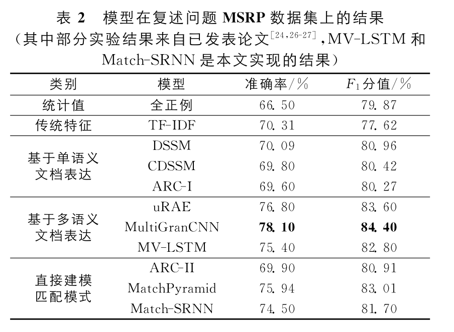

* 基于多语义文档表达和直接建模匹配模式的这两类模型明显优于基于单语 义文档表达的模型。主要的原因在于复述问题本身更注重细粒度的匹配和对匹配模式的挖掘。
* 进而我们发现最好的模型是基于多语义文档表达的uRAE和MultiGranCNN，主要的原因是这两个模型在更大的数据集上进行了**参数预训练**。

### 自动问答

任务：自动问答中问题和答案属于异质不可交换的，更偏向于一个语义匹配的问题，答案和问题相同的词比较少。

数据集：Yahoo! Answers社区问答数据集

结果：

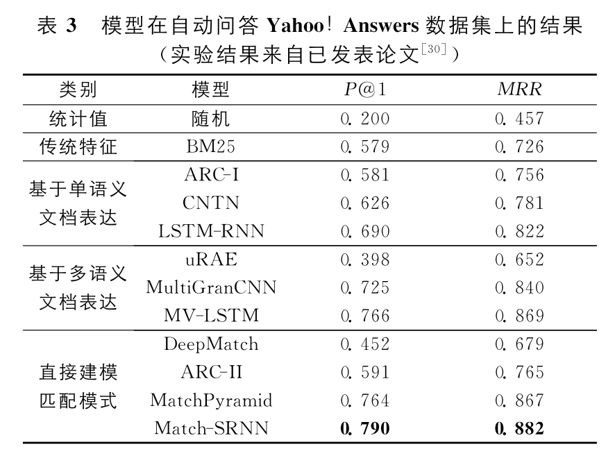

* 我们发现基于多语义文档表达和直接建模匹配模式的深度匹配模型要优于基于单语义文档表达的模型，主要原因还是细粒度的表达对于匹配问题是很重要的。

### 信息检索

任务：信息检索中的查询项和文档中的关键词匹配占主导作用，而且查询项和文档的长度差异较大。

数据集：Robust04

结果：

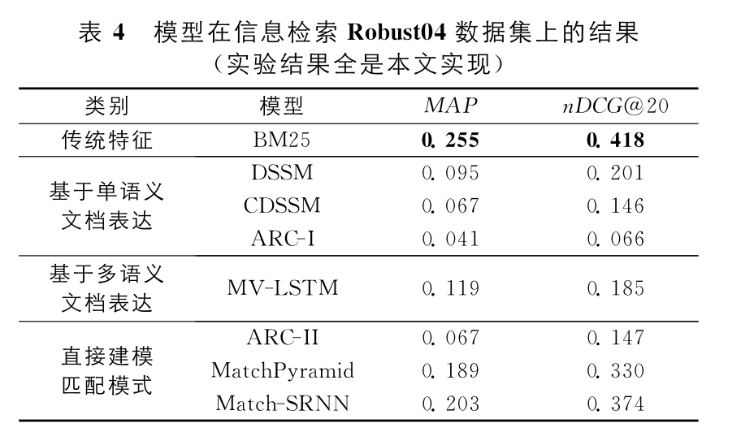

在信息检索的任务中，我们发现深度模型的表现并不好，较好的模型和传统BM25特征还是有一定差距的。其中主要的原因与信息检索任务的特点有关：

* 查询项和文档的长度差异很大；
* 对精确匹配的要求比语义匹配要高很多， 仅使用精确匹配信息（例如BM25），就能达到很好的效果；
* 在信息检索中引入词向量表达，有助于刻画查询项和文档之间语义匹配的关系，但是由于大量不相关的词也会计算得到一个匹配度，引入了太多噪声，再加上数据集本身数据量太小，最终导致深度模型更容易拟合到噪声上，影响了深度模型的效果。MatchPyramid和Match-SRNN模型对细粒度的匹配信号保留的最好，选择合适的相似度计算函数（例如异或函数或者余弦相似度），拉开精确匹配和语义匹配的距离就能得到较好的效果。

## 未来研究方向展望

* **变长文本问题**

  基于深度学习的文本匹配模型只能处理句子长度适中（10～500词）的文本。对于过长或者过短的文本，模型处理起来都比较棘手。

  可以结合**查询扩展**和**文档摘要**来协助，前者可以丰富短文本信息，后者可以压缩长文本信息。

* **匹配可解释性**
* **判别式模型到生成式模型**
* **跨模态文本匹配**

