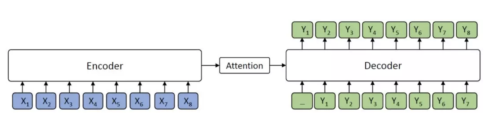

# MASS

在序列到序列的自然语言生成任务中，目前主流预训练模型并没有取得显著效果。为此，微软亚洲研究院的研究员在ICML 2019上提出了**一个全新的通用预训练方法MASS，在序列到序列的自然语言生成任务中全面超越BERT和GPT。**

MASS是**专门针对序列到序列的自然语言生成任务的预训练方法。**比如机器翻译、文本摘要生成、对话生成、问答、文本风格转换等。在这类任务中，目前主流的方法是编码器-注意力-解码器框架。

**BERT通常只训练一个编码器\(基于Transformer encoder\)用于自然语言理解，而GPT的语言模型通常是训练一个解码器\(基于Transformer decoder\)。如果要将BERT或者GPT用于序列到序列的自然语言生成任务，通常只有分开预训练编码器和解码器，因此编码器-注意力-解码器结构没有被联合训练，记忆力机制也不会被预训练，而解码器对编码器的注意力机制在这类任务中非常重要，因此BERT和GPT在这类任务中只能达到次优效果！**

## **MASS预训练方法**

**MASS核心思想：**MASS对句子随机屏蔽一个长度为k的连续片段，然后通过编码器-注意力-解码器模型预测生成该片段。

\*\*\*\*

