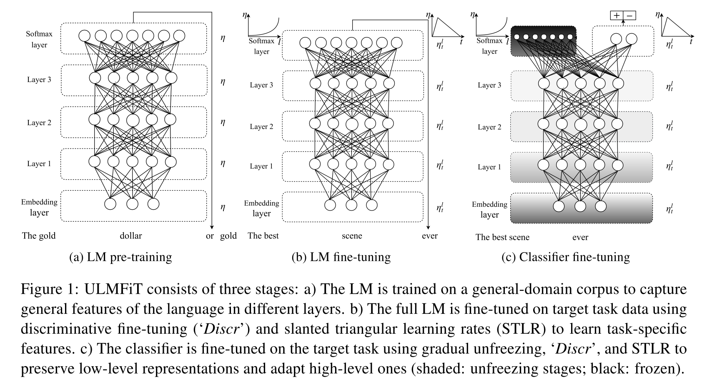
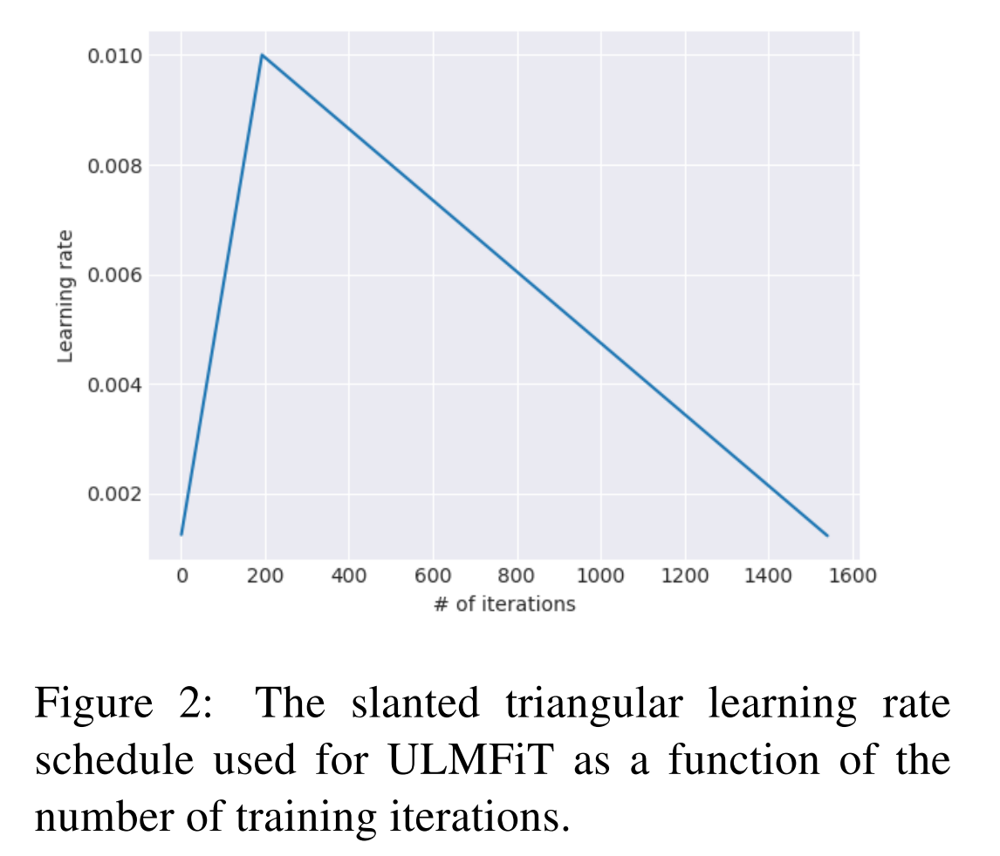

# ULM-Fit

他们提出了_**ULMFit**_ 结构，其实这**本质上是他们提出的一个方法，而不是具体的某种结构或模型**。只不过正如论文标题所言，他们主要把它应用于文本分类问题中。

和 ELMo 相同的地方在于，ULMFit 同样使用了语言模型，并且预训练的模型主要也是LSTM，基本思路也是预训练完成后在具体任务上进行 finetune，但不同之处也有很多。

## ULM-Fit的三个阶段

**首先，ULMFit 的预训练和 finetune 过程主要分为三个阶段：**

* 分别是在大规模语料集上（比如 Wikitext 103，有 103 million 个词）先预训练；
* 然后再将预训练好的模型在具体任务的数据上利用语言模型来 finetune（第一次 finetune，叫做 LM finetune）；
* 再根据具体任务设计的模型上，将预训练好的模型作为这个任务模型的多层，再一次 finetune（第二次 finetune，如果是分类问题的话可以叫做 Classifier finetune）。

整个过程如下图所示：

## ULM-Fit使用的基本模型

**其次，**所使用的模型来自于 2017 年 Salesforce 的论文 _**Regularizing and Optimizing LSTM Language Models**_，在这篇文章中，他们提出了 _**AWD-LSTM**_，正如名字中所揭示的，这个框架更多的是一种训练方法，主要思想分为两大块：

* 其中 Averaged SGD 是指先将模型训练到一定 epoch，然后再将其后的每一轮权值进行平均后，得到最终的权值。
* 除了使用 ASGD 方法训练模型之外，在普通 LSTM 上一个时刻和下一个时刻之间的隐藏层之间是有连接的，并且这个连接通过一个全连接的矩阵相连，而这个模型则用了 DropConnect 的方法随机 drop 掉一些连接，从而减少了一些过拟合的风险，当然在输入层到隐藏层之间也有正常的 dropout 操作。

## ULM-Fit的微调方法

微调方法设计非常精妙。**作者提出了几种微调的技巧，它们是：discriminative fine-tuning, slanted triangular learning rates 以及 gradual unfreezing。**

* **discriminative fine-tuning\(有区分的fine-tuning\)**：**基本思想是针对不同层在训练更新参数的时候，赋予不同的学习率。**这里的出发点是，对于 NLP 的深度学习模型来说，不同层的表征有不同的物理含义，比如浅层偏句法信息，高层偏语义信息，因此对于不同层的学习率不同，自然就是比较合理的了。**原文也给出了具体的选择：先指定最后一层的学习率，然后根据下式** $$n^{l-1}=\frac{n^l}{2.6}$$ **得到前面层的学习率，基本思想是让浅层的学习率要更小一些。**
* **slanted triangular learning rates\(斜三角学习率\)**：主要思想便是在 finetune 的第一阶段，希望能够先稳定住原来已经在大规模语料集上预训练好的参数，所以选择一个比较小的 finetune 学习率。而后希望能够逐步加大学习率，使得学习过程能够尽量快速。当训练接近尾声时，逐步减小学习率，这样让模型逐渐平稳收敛。借鉴了Transformer中wram-up学习率调节方法。

*  **gradual unfreezing\(逐层解冻\)**：主要思想是把预训练模型在新任务上 finetune 时，逐层解冻模型，也就是先 finetune 最后一层，然后再解冻倒数第二层，把倒数第二层和最后一层一起 finetune，然后再解冻第三层。以此类推，逐层往浅层推进，最终 finetune 整个模型或者终止到某个中间层。这样做的目的也是为了 **finetune 过程能够更平稳**。

论文中主要把 discriminative fine-tuning 和 slanted triangular learning rates 这两个技巧用在了语言模型的 fine-tune 阶段，把最后一个 gradual unfreezing 的技巧应用在最终 task-specifi-model 的 fine-tune 阶段。

通过上面的这些方法，**ULMFiT 最终在分类任务上表现惊艳，尤其是只需要 100 个标记数据，就能够学习到一个表现非常 comparable 的分类器。**不得不说，这个过程中预训练的语言模型，对最终表现起到了至关重要的作用。

