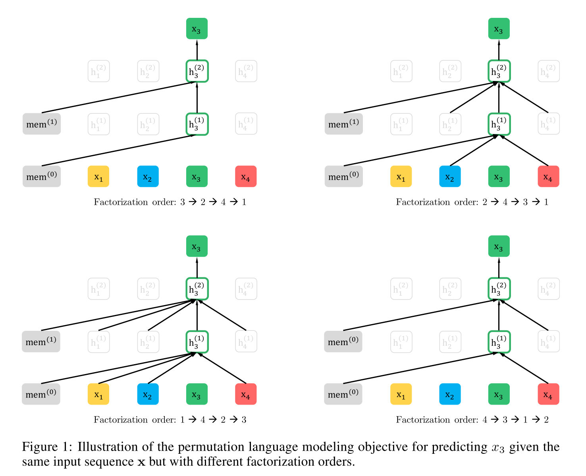
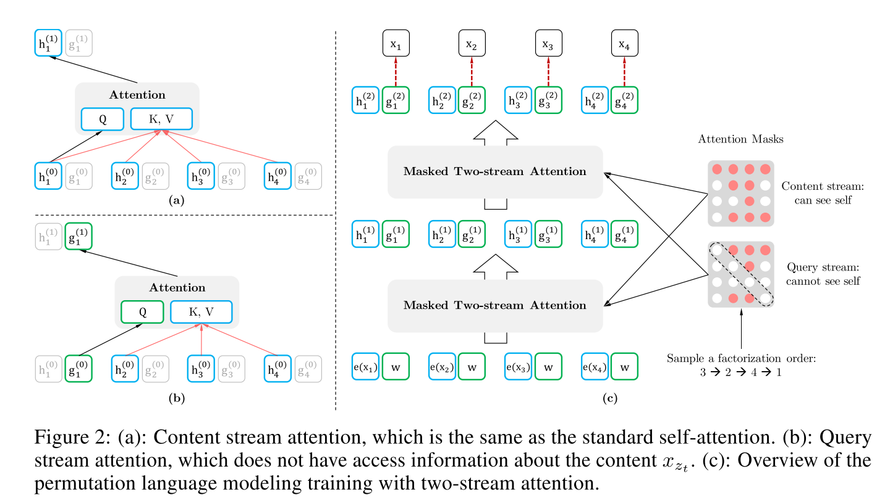
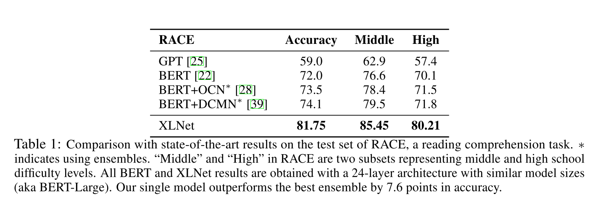

# XLNet

XLNet和Bert比，有什么异同？有什么模型方面的改进？在哪些场景下特别有效？原因又是什么？本文通过论文思想解读及实验结果分析，试图回答上述问题。

## XLNet的优势

* **排列语言模型PLM**
* **Two-Stream Self-Attention for Target-Aware Representations**
  * 没有目标\(target\)位置信息的问题
  * Two-Stream Self-Attention
* **部分预测**
* **融入Transformer-XL的优点**
  * Segment基本的状态重用
  * Transformer-XL的相对位置编码
  * 在XLNet里融入Transformer-XL的思想
* **建模多个segment**
  * 相对Segment编码

## XLNet Motivation

首先，XLNet引入了**自回归语言模型**以及**自编码语言模型**的提法。

### 自回归语言模型

在ELMO／BERT出来之前，大家通常讲的语言模型其实是根据上文内容预测下一个可能跟随的单词，就是**常说的自左向右的语言模型任务，或者反过来也行，就是根据下文预测前面的单词，这种类型的LM被称为自回归语言模型。**

GPT 就是典型的自回归语言模型。ELMO尽管看上去利用了上文，也利用了下文，但是本质上仍然是自回归LM，这个跟模型具体怎么实现有关系。ELMO是做了两个方向（从左到右以及从右到左两个方向的语言模型），但是是分别有两个方向的自回归LM，然后把LSTM的两个方向的隐节点状态拼接到一起，来体现双向语言模型这个事情的。所以其实是两个自回归语言模型的拼接，本质上仍然是自回归语言模型。

**自回归语言模型有优点有缺点：**

* **缺点**：只能利用上文或者下文的信息，不能同时利用上文和下文的信息，当然，貌似ELMO这种双向都做，然后拼接看上去能够解决这个问题，因为融合模式过于简单，所以效果其实并不是太好**。**
* **优点**：其实跟下游NLP任务有关，比如生成类NLP任务，比如文本摘要，机器翻译等，在实际生成内容的时候，就是从左向右的，自回归语言模型天然匹配这个过程。而Bert这种DAE模式，在生成类NLP任务中，就面临训练过程和应用过程不一致的问题，导致生成类的NLP任务到目前为止都做不太好。

### 自编码语言模型

自回归语言模型只能根据上文预测下一个单词，或者反过来，只能根据下文预测前面一个单词。相比而言，Bert通过在输入X中随机Mask掉一部分单词，然后预训练过程的主要任务之一是根据上下文单词来预测这些被Mask掉的单词，如果你对Denoising Autoencoder比较熟悉的话，会看出，**这确实是典型的DAE的思路。那些被Mask掉的单词就是在输入侧加入的所谓噪音。类似Bert这种预训练模式，被称为DAE LM。**

这种DAE LM的优缺点正好和自回归LM反过来：

* **优点：**它能比较自然地融入双向语言模型，同时看到被预测单词的上文和下文，这是好处。
* **缺点：**主要在输入侧引入\[Mask\]标记，导致预训练阶段和Fine-tuning阶段不一致的问题，因为Fine-tuning阶段是看不到\[Mask\]标记的。DAE吗，就要引入噪音，\[Mask\] 标记就是引入噪音的手段，这个正常。

**XLNet的Motivation就是：**能否融合自回归LM和DAE LM两者的优点。就是说如果站在自回归LM的角度，如何引入和双向语言模型等价的效果；如果站在DAE LM的角度看，它本身是融入双向语言模型的，如何抛掉表面的那个\[Mask\]标记，让预训练和Fine-tuning保持一致。

对于Bert的自编码语言模型也有对应的缺点，XLNet在文中指出的：

* 第一个是Bert,预训练阶段因为采取引入\[Mask\]标记来Mask掉部分单词的训练模式，而Fine-tuning阶段是看不到这种被强行加入的Mask标记的，所以**两个阶段存在使用模式不一致的情形，这可能会带来一定的性能损失；**
* 另外一个是，Bert在第一个预训练阶段，假设句子中多个单词被Mask掉，**这些被Mask掉的单词之间没有任何关系，是条件独立的，而有时候这些单词之间是有关系的，**XLNet则考虑了这种关系（关于这点原因是否可靠，后面会专门分析）。

**上面两点是XLNet在第一个预训练阶段，相对Bert来说要解决的两个问题。**

## XLNet核心

XLNet仍然遵循两阶段的过程，第一个阶段是语言模型预训练阶段；第二阶段是任务数据Fine-tuning阶段。**它主要希望改动第一个阶段，就是说不像Bert那种带Mask符号的Denoising-autoencoder的模式，而是采用自回归LM的模式。**就是说，看上去输入句子X仍然是自左向右的输入，看到Ti单词的上文Context\_before，来预测Ti这个单词。但是又希望在Context\_before里，不仅仅看到上文单词，也能看到Ti单词后面的下文Context\_after里的下文单词，这样的话，Bert里面预训练阶段引入的Mask符号就不需要了，于是在预训练阶段，看上去是个标准的从左向右过程，Fine-tuning当然也是这个过程，于是两个环节就统一起来。当然，这是目标。剩下是怎么做到这一点的问题。

  

那么，怎么能够在单词Ti的上文中Contenxt\_before中揉入下文Context\_after的内容呢？你可以想想。**XLNet是这么做的，在预训练阶段，引入Permutation Language Model的训练目标。**什么意思呢？就是说，比如包含单词Ti的当前输入的句子X，由顺序的几个单词构成，比如x1,x2,x3,x4四个单词顺序构成。我们假设，其中，要预测的单词Ti是x3，位置在Position 3，要想让它能够在上文Context\_before中，也就是Position 1或者Position 2的位置看到Position 4的单词x4。可以这么做：假设我们固定住x3所在位置，就是它仍然在Position 3，之后随机排列组合句子中的4个单词，在随机排列组合后的各种可能里，再选择一部分作为模型预训练的输入X。比如随机排列组合后，抽取出x4,x2，x3,x1这一个排列组合作为模型的输入X。于是，x3就能同时看到上文x2，以及下文x4的内容了。**这就是XLNet的基本思想：看上去仍然是个自回归的从左到右的语言模型，但是其实通过对句子中单词排列组合，把一部分Ti下文的单词排到Ti的上文位置中，于是，就看到了上文和下文，但是形式上看上去仍然是从左到右在预测后一个单词。**

**当然，上面讲的仍然是基本思想。难点其实在于具体怎么做才能实现上述思想。**首先，需要强调一点，尽管上面讲的是把句子X的单词排列组合后，再随机抽取例子作为输入，但是，实际上你是不能这么做的，因为Fine-tuning阶段你不可能也去排列组合原始输入。所以，就必须让预训练阶段的输入部分，看上去仍然是x1,x2,x3,x4这个输入顺序，但是可以在Transformer部分做些工作，来达成我们希望的目标。**具体而言，XLNet采取了Attention掩码的机制，**你可以理解为，当前的输入句子是X，要预测的单词Ti是第i个单词，前面1到i-1个单词，在输入部分观察，并没发生变化，该是谁还是谁。但是在Transformer内部，通过Attention掩码，从X的输入单词里面，也就是Ti的上文和下文单词中，随机选择i-1个，放到Ti的上文位置中，把其它单词的输入通过Attention掩码隐藏掉，于是就能够达成我们期望的目标（当然这个所谓放到Ti的上文位置，只是一种形象的说法，**其实在内部，就是通过Attention Mask，把其它没有被选到的单词Mask掉，不让它们在预测单词Ti的时候发生作用，如此而已。**看着就类似于把这些被选中的单词放到了上文Context\_before的位置了）。具体实现的时候，XLNet是用“双流自注意力模型”实现的，细节可以参考论文，但是基本思想就如上所述，双流自注意力机制只是实现这个思想的具体方式，理论上，你可以想出其它具体实现方式来实现这个基本思想，也能达成让Ti看到下文单词的目标。（**使用attention mask来实现排列组合**）

**这里简单说下“双流自注意力机制”：**

* **内容流自注意力**，其实就是标准的Transformer的计算过程；
* **Query流自注意力**，它的主要的，这个是干嘛的呢？**其实就是用来代替Bert的那个\[Mask\]标记的，因为XLNet希望抛掉\[Mask\]标记符号，**但是比如知道上文单词x1,x2，要预测单词x3，此时在x3对应位置的Transformer最高层去预测这个单词，但是输入侧不能看到要预测的单词x3，Bert其实是直接引入\[Mask\]标记来覆盖掉单词x3的内容的，等于说\[Mask\]是个通用的占位符号。而XLNet因为要抛掉\[Mask\]标记，但是又不能看到x3的输入，**于是Query流，就直接忽略掉x3输入了，只保留这个位置信息，用参数w来代表位置的embedding编码。其实XLNet只是扔了表面的\[Mask\]占位符号，内部还是引入Query流来忽略掉被Mask的这个单词。和Bert比，只是实现方式不同而已。**

上面讲的Permutation Language Model是XLNet的主要理论创新，所以介绍的比较多，从模型角度讲，这个创新还是挺有意思的，因为**它开启了自回归语言模型如何引入下文的一个思路，**相信对于后续工作会有启发。当然，XLNet不仅仅做了这些，它还引入了其它的因素，也算是一个当前有效技术的集成体。**感觉XLNet就是Bert、GPT 2.0和Transformer XL的综合体变身，首先，它通过PLM预训练目标，吸收了Bert的双向语言模型；然后，GPT2.0的核心其实是更多更高质量的预训练数据，这个明显也被XLNet吸收进来了；再然后，Transformer XL的主要思想也被吸收进来，它的主要目标是解决Transformer对于长文档NLP应用不够友好的问题。**

## 与Bert预训练的异同

尽管看上去，XLNet在预训练机制引入的Permutation Language Model这种新的预训练目标，和Bert采用Mask标记这种方式，有很大不同。其实你深入思考一下，会发现，两者本质是类似的。区别主要在于：Bert是直接在输入端显示地通过引入Mask标记，在输入侧隐藏掉一部分单词，让这些单词在预测的时候不发挥作用，要求利用上下文中其它单词去预测某个被Mask掉的单词；而XLNet则抛弃掉输入侧的Mask标记，通过Attention Mask机制，在Transformer内部随机Mask掉一部分单词（这个被Mask掉的单词比例跟当前单词在句子中的位置有关系，位置越靠前，被Mask掉的比例越高，位置越靠后，被Mask掉的比例越低），让这些被Mask掉的单词在预测某个单词的时候不发生作用。**所以，本质上两者并没什么太大的不同，只是Mask的位置，Bert更表面化一些，XLNet则把这个过程隐藏在了Transformer内部而已。这样，就可以抛掉表面的\[Mask\]标记，解决它所说的预训练里带有\[Mask\]标记导致的和Fine-tuning过程不一致的问题。**至于说XLNet说的，Bert里面被Mask掉单词的相互独立问题，也就是说，在预测某个被Mask单词的时候，其它被Mask单词不起作用，这个问题，你深入思考一下，其实是不重要的，因为XLNet在内部Attention Mask的时候，也会Mask掉一定比例的上下文单词，只要有一部分被Mask掉的单词，其实就面临这个问题。而如果训练数据足够大，其实不靠当前这个例子，靠其它例子，也能弥补被Mask单词直接的相互关系问题，因为总有其它例子能够学会这些单词的相互依赖关系。

**当然，XLNet这种改造，维持了表面看上去的自回归语言模型的从左向右的模式，这个Bert做不到，这个有明显的好处，就是对于生成类的任务，能够在维持表面从左向右的生成过程前提下，模型里隐含了上下文的信息。所以看上去，XLNet貌似应该对于生成类型的NLP任务，会比Bert有明显优势。另外，因为XLNet还引入了Transformer XL的机制，所以对于长文档输入类型的NLP任务，也会比Bert有明显优势。**

## 哪些因素在起作用

XLNet起作用的，如果宏观归纳一下，共有三个因素；

* 与Bert采取De-noising Autoencoder方式不同的新的预训练目标：**Permutation Language Model\(简称PLM\)；这个可以理解为在自回归LM模式下，如何采取具体手段，来融入双向语言模型。这个是XLNet在模型角度比较大的贡献，确实也打开了NLP中两阶段模式潮流的一个新思路。**
* **引入了Transformer-XL的主要思路：相对位置编码以及分段RNN机制。实践已经证明这两点对于长文档任务是很有帮助的；**
* **加大增加了预训练阶段使用的数据规模；**Bert使用的预训练数据是BooksCorpus和英文Wiki数据，大小13G。XLNet除了使用这些数据外，另外引入了Giga5，ClueWeb以及Common Crawl数据，并排掉了其中的一些低质量数据，**大小分别是16G,19G和78G。可以看出，在预训练阶段极大扩充了数据规模，并对质量进行了筛选过滤。这个明显走的是GPT2.0的路线。**

### **实验各个任务实验结果**

**1，阅读理解任务相对bert提升明显！**

除了XLNet的融合双向信息的自回归语言模型PLM的作用，引入的Transformer-XL的特性可能起到的作用更大，因为正是它使得XLNet处理长文档更有优势的。

**2，文本分类任务**

相比bert，效果有提升，但没有在阅读理解任务上提升的大。

**3，信息检索任务**

相比bert，效果有提升，但没有在阅读理解任务上提升的大。

**4，与bert相同规模预训练数据集的各个实验对比**

相比bert，长文档阅读理解提升幅度明显，其他任务还好...

从实验结果归纳一下的话，可以看出：**XLNet综合而言，效果是优于Bert的，尤其是在长文档类型任务，效果提升明显。如果进一步拆解的话，因为对比实验不足，只能做个粗略的结论：预训练数据量的提升，大概带来30%左右的性能提升，其它两个模型因素带来剩余的大约70%的性能提升。**当然，这个主要指的是XLNet性能提升比较明显的阅读理解类任务而言。对于其它类型任务，感觉Transformer XL的因素贡献估计不会太大，主要应该是其它两个因素在起作用。

## **对NLP应用任务的影响**

XLNet其实本质上还是ELMO／GPT／Bert这一系列两阶段模型的进一步延伸。在将自回归LM方向引入双向语言模型方面，感觉打开了一个新思路，这点还是非常对人有启发的。当然，如果深入思考，其实和Bert并没有太大的不同。

如果让我推论下XLNet的出现，对后续NLP工作的影响，我觉得跟Bert比，最直接的影响应该有两个：

**一个是对于Bert长文档的应用，**因为Transformer天然对长文档任务处理有弱点，所以XLNet对于长文档NLP任务相比Bert应该有直接且比较明显的性能提升作用，它在论文中也证明了这点。所以，以后长文档类型的NLP应用，XLNet明显跟Bert比占优势。当然，你说我把Transformer XL的因素引入Bert，然后继续在Bert上做改进，明显这也是可以的。

**第二点，对于生成类的NLP任务，**到目前为止，尽管出了一些改进模型，但是从效果看，Bert仍然不能很好地处理。而因为XLNet的预训练模式天然符合下游任务序列生成结果，所以按理说能够直接通过引入XLNet来改进生成类NLP任务的效果。所以，这点估计是XLNet会明显占优势的一个领域。

可以预计的是，很快我们就会看到XLNet在文本摘要，机器翻译，信息检索…..等符合上述XLNet应用领域特点和优势领域的应用结果，以及在这些任务上的进一步改进模型。





