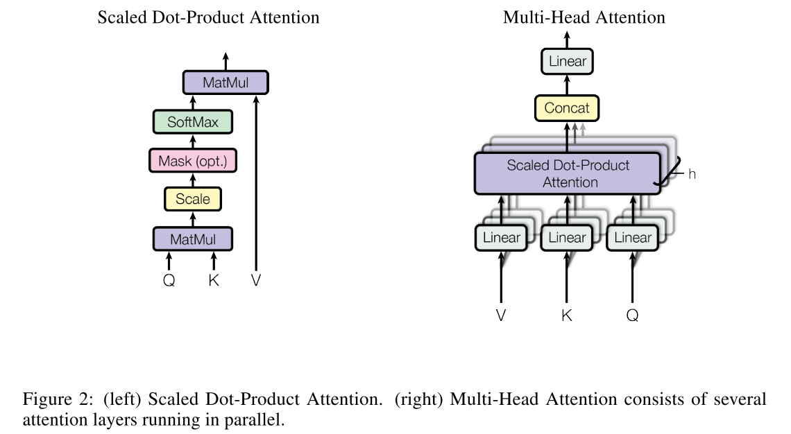
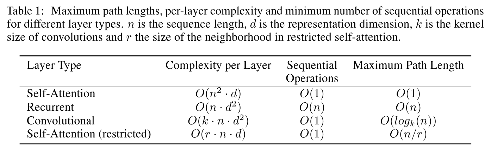
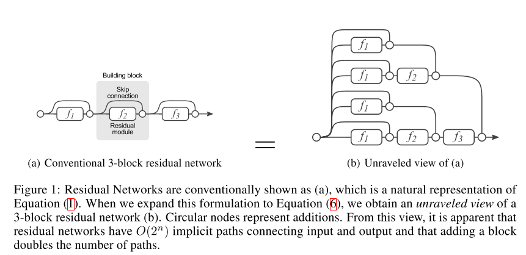
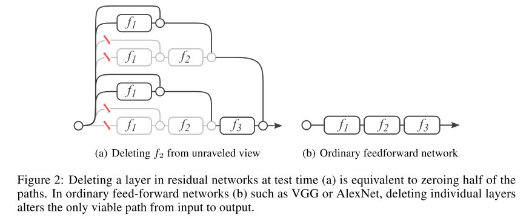

# Transformer

## Transformer的结构

Transformer是第一个完全依靠self-attention来计算它的输入序列和输出序列的表示而无需使用序列对齐的RNN和CNN的transduction model.

比较有竞争力的神经序列转录模型通常都是encoder-decoder架构，Transformer也不例外。Transformer的encoder将输入序列 $$(x_1,x_2,...,x_n)$$ 映射为语义表示序列 $$\mathbf{z}=(z_1,z_2,...,z_n)$$ ;然后decoder依据 $$\mathbf{z}$$ 一次一个元素地生成输出序列 $$(y_1,y_2,...,y_n)$$ ，**模型每一步都是自回归的，即当生成下一个元素的时候，之前生成的元素会被作为额外的输入。**Transformer的整体架构如下：

特点有以下几点：

* **Multi-head self-attention**
* **分离的Positional Encoding**
* **Residual connection or Skip connection\(残差连接\)**
* **Layer normalization**
* **Position-wise Feed-Forward network**
* **Regularization**

### 1，Multi-head self-attention

**Scaled Dot-Product Attention：**

$$
Attention(Q,K,V) = softmax(\frac{QK^T}{\sqrt{d_k}})V
$$

之所以，要进行scale，是因为当 $$d_k$$ 较大时，点积大幅增大，**会将softmax函数推进到具有极小梯度的区域。**

**Multi-Head Attention：**

$$
MultiHead(Q,K,V)=Concat(head_1,head_2,...,head_h)W^O\\
head_i=Attention(QW_i^Q,KW_i^K,VW_i^V)
$$

**从上表可以得出Self-attention有以下几点好处：**

* self-attention通过常数的序列操作就可以到连接所有位置，这说明序列中任意位置之间的路径长度是常数，很好地解决了长期依赖的问题。
* self-attention在计算序列表示时可以并行计算，而RNN只能按顺序计算；
* 当序列长度n小于表示维度d时，self-attention层比RNN层计算速度快。而实际中，n几乎永远小于d；

**Mask self-attention：**

**Decoder 中有许多 mask 操作，参与运算的三个矩阵 Q,K 和 V 都要做许多 mask 操作，主要有两方面作用：**一方面是消除输入句子本身长度之外的 padding 影响，另一方面是 decode r 必须要求不能提前看到待生成的词。

**Encoder与Decoder中self-attention的动态过程如下：**

### 2，Positional Encoding

self-attention缺少了位置信息，所以我们必须单独进行位置编码将序列中每个元素的相对位置或绝对位置信息加进去。

$$
PE(pos,2i)=sin(pos/10000^{2i/d_{model}})\\
PE(pos,2i+1)=cos(pos/10000^{2i/d_{model}})
$$

我们之所以选择这个函数，是因为我们假设它可以让模型很容易地通过相对位置来学习，因为对于任何固定偏移k， ****$$PE_{pos+k}$$可以表示为 $$PE_{pos}$$ 的线性函数。

我们还尝试使用学习的位置嵌入，并发现这两个版本产生了几乎相同的结果。 **我们选择了正弦曲线版本，因为它可以允许模型外推到比训练期间遇到的序列长度更长的序列长度。**

### 3，Residual Connection

* 残差网络可以看作**多路径网络的集合**，取代了传统的单一路径网络。（有ensemble的思想）
* 残差网络中各个路径都是不相互依赖的，这一不相关性很好的**增加了整体结构的正则效果。**
* 对网络训练过程中梯度有贡献的路径集中在**浅层处（有效路径**），因此残差网络并没有通过保留每一层的梯度信息的手段解决Vanishing gradient问题，而是通过**增加有效短路径权重的方式实现。**

### 4，Layer normalization

### 5，**Position-wise Feed-Forward network**

Position-wise意味着是按位置依次进行FFN的。FFN如下：

$$
FFN(x)=Relu(xW_1+b)W_2+b
$$

### 6，Regularization

* Residual dropout
* label smoothing

