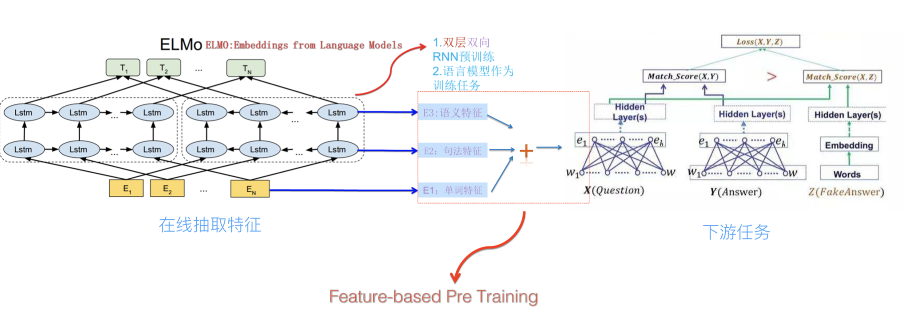
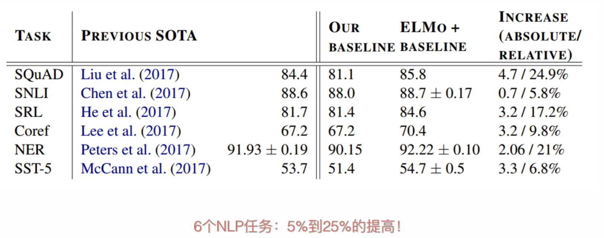

# ELMo

由于普通的Word embedding无法区分多义词的不同语义，所以ELMo出现了。

**ELMo的本质思想是：**事先用语言模型学好一个单词的Word Embedding，此时多义词无法区分，不过这没关系。在实际使用Word Embedding的时候，单词已经具备了特定的上下文了，这个时候可以根据上下文单词的语义去调整单词的Word Embedding表示，这样经过调整后的Word Embedding更能表达在这个上下文中的具体含义，自然也就解决了多义词的问题了。**所以ELMO本身是个根据当前上下文对Word Embedding动态调整的思路。**

## ELMo的模型结构

**ELMo 的基本框架便是 2-stacked biLSTM + Residual 的结构\(**残差结构结构能让训练更稳定**\)，**不过和普通 RNN 结构的不同之处在于，ELMo 借鉴了 2016 年 Google Brain 的 Rafal Jozefowicz 等人发表的 _**Exploring the Limits of Language Modeling**_，其主要改进在于输入层和输出层不再是 word，而是变为了一个 char-based CNN 结构，ELMo 在输入层和输出层考虑了使用同样的这种结构，该结构如下图示：

这种先经过 CNN 得到词向量，然后再计算 Softmax 的方法叫做 CNN Softmax。**利用 CNN 解决有三点优势值得注意：**

* CNN 能减少普通做 Softmax 时全连接层中的必须要有的 \|V\|h 的参数规模，只需保持 CNN 内部的参数大小即可。一般来说，CNN 中的参数规模都要比 \|V\|h 的参数规模小得多；
* CNN 可以解决 OOV （Out-of-Vocabulary）问题，这个在翻译问题中尤其头疼；
* 在预测阶段，CNN 对于每一个词向量的计算可以预先做好，更能够减轻 inference 阶段的计算压力。
* CNN Softmax 的好处就在于能够做到对于不同的词，映射参数都是共享的，这个共享便体现在使用的 CNN 中的参数都是同一套，从而大大减少参数的规模。
* 同样的，对于输入层，ELMo 也是用了一样的 CNN 结构，只不过参数不一样而已。和输出层中的分析类似，输入层中 CNN 的引入同样可以减少参数规模。

ELMo的大体框架如下：

**ELMo采用了典型的两阶段过程：**

* 第一个阶段是利用语言模型进行预训练；
* 第二个阶段是在做下游任务时，从预训练网络中提取对应单词的网络各层的Word Embedding作为新特征补充到下游任务中。

上图展示的是其预训练过程，它的网络结构采用了双层双向LSTM，目前语言模型训练的任务目标是根据单词的上下文去正确预测单词**，****之前的单词序列Context-before称为上文，之后的单词序列Context-after称为下文**。图中左端的前向双层LSTM代表正方向编码器，输入的是从左到右顺序的除了预测单词外的上文Context-before；右端的逆向双层LSTM代表反方向编码器，输入的是从右到左的逆序的句子下文Context-after；每个编码器的深度都是两层LSTM叠加。这个网络结构其实在NLP中是很常用的。

**它的目标函数如下：**

$$
\sum_{k=1}^{N}\log p(t_k|t_1,...,t_{k-1})+\log p(t_k|t_{k+1},...,t_N)
$$

使用这个网络结构利用大量语料做语言模型任务就能预先训练好这个网络，**如果训练好这个网络后，输入一个新句子** **，句子中每个单词都能得到对应的三个Embedding：**

* 最底层是单词的Word Embedding，即输入层 CNN 的输出（单词特征）**；**
* 往上走是第一层双向LSTM中对应单词位置的Embedding，这层编码单词的句法信息更多一些（句法特征）；
* 再往上走是第二层LSTM中对应单词位置的Embedding，这层编码单词的语义信息更多一些（语义特征）。

**ELMo的预训练过程不仅仅学会单词的Word Embedding，还学会了一个双层双向的LSTM网络结构，而这两者后面都有用！**

## 训练好的ELMo的使用方法

当预训练好ELMo之后，怎么应用于下游任务呢？

上图展示了下游任务的使用过程，比如我们的下游任务仍然是QA问题：

此时对于问句X，我们可以先将句子X作为预训练好的ELMo网络的输入，这样句子X中每个单词在ELMO网络中都能获得对应的三个Embedding，**之后给予这三个Embedding中的每一个Embedding一个权重a，这个权重可以学习得来，根据各自权重累加求和，将三个Embedding整合成一个。然后将整合后的这个Embedding作为X句在自己任务的那个网络结构中对应单词的输入，以此作为补充的新特征给下游任务使用**。对于上图所示下游任务QA中的回答句子Y来说也是如此处理。**因为ELMO给下游提供的是每个单词的特征形式，所以这一类预训练的方法被称为“Feature-based Pre-Training”。**

上面这个图是发表在2017ACL的TagLM采用类似ELMo的思路做命名实体识别任务的过程，其步骤基本如上述ELMO的思路，和ELMo作者是同一批，可以看做是ELMo的前导工作。

前几天这个PPT发出去后有人质疑说FastAI的在18年4月提出的ULMFiT才是抛弃传统Word Embedding引入新模式的开山之作，我深不以为然。首先TagLM出现的更早而且模式基本就是ELMO的思路；**另外ULMFiT使用的是三阶段模式，在通用语言模型训练之后，加入了一个领域语言模型预训练过程，而且论文重点工作在这块，方法还相对比较繁杂，这并不是一个特别好的主意，**因为领域语言模型的限制是它的规模往往不可能特别大，精力放在这里不太合适，放在通用语言模型上感觉更合理；再者，尽管ULFMiT实验做了6个任务，但是都集中在分类问题相对比较窄，不如ELMO验证的问题领域广，我觉得这就是因为第二步那个领域语言模型带来的限制。所以综合看，尽管ULFMiT也是个不错的工作，但是重要性跟ELMO比至少还是要差一档，当然这是我个人看法。每个人的学术审美口味不同，我个人一直比较赞赏要么简洁有效体现问题本质要么思想特别游离现有框架脑洞开得异常大的工作，所以ULFMiT我看论文的时候就感觉看着有点难受，觉得这工作没抓住重点而且特别麻烦，但是看ELMO论文感觉就赏心悦目，觉得思路特别清晰顺畅，看完暗暗点赞，心里说这样的文章获得NAACL2018最佳论文当之无愧，比ACL很多最佳论文也好得不是一点半点，这就是好工作带给一个有经验人士的一种在读论文时候就能产生的本能的感觉，也就是所谓的这道菜对上了食客的审美口味。

实验效果见上图，6个NLP任务中性能都有幅度不同的提升，最高的提升达到25%左右，而且这6个任务的覆盖范围比较广，包含句子语义关系判断，分类任务，阅读理解等多个领域，**这说明其适用范围是非常广的，普适性强，这是一个非常好的优点。**

**总之，之前的都是静态Word Embedding，所以无法解决多义词的问题，而ELMo引入上下文动态调整单词的embedding后成功地解决了多义词问题！**

**事后看ELMo\(和GPT、Bert对比\)有两个缺点：**

* **LSTM抽取特征能力远弱于Transformer；**
* **拼接方式双向融合特征，融合能力弱。**

