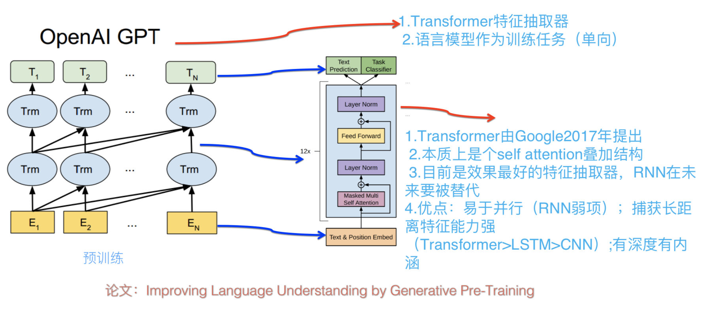
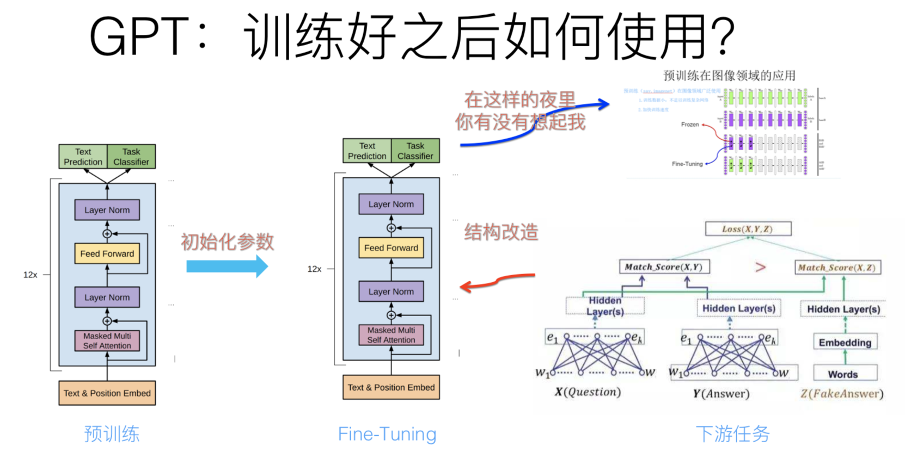
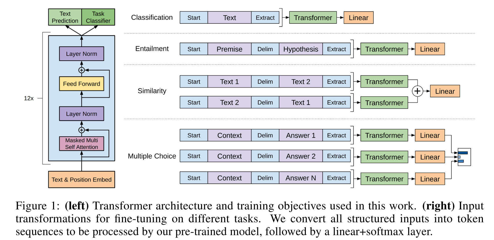
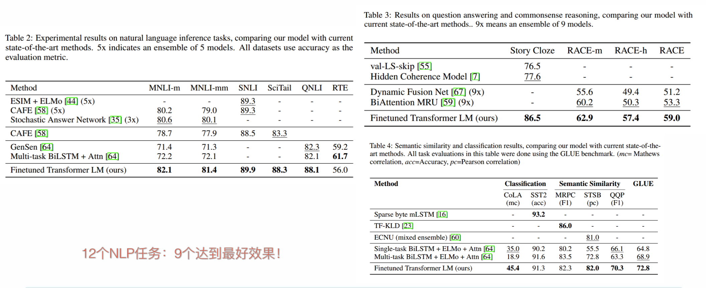
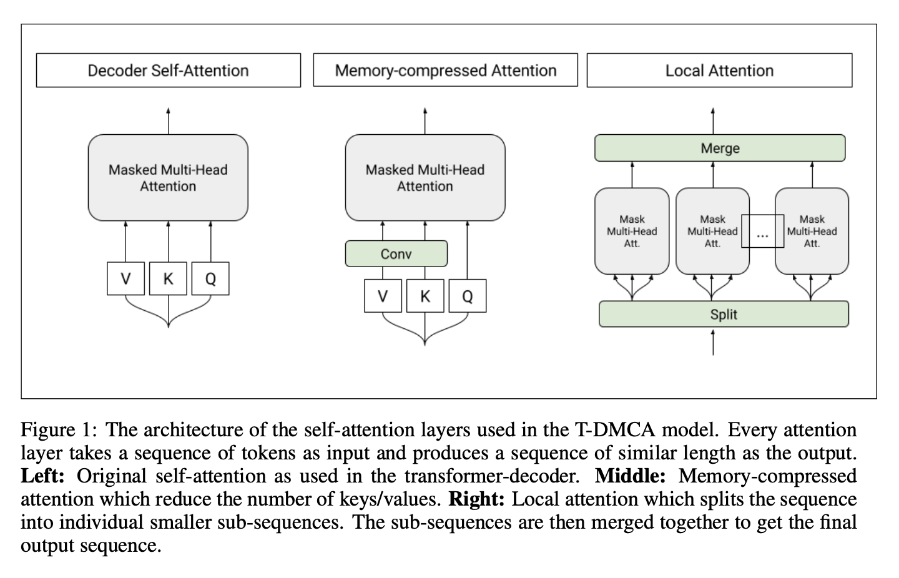

# GPT1.0

## GPT的模型结构

**GPT也采用两阶段过程：**

* 第一个阶段是利用语言模型进行预训练；
* 第二阶段通过Fine-tuning的模式解决下游任务\(使用了**discriminative fine-tune**\)。

**上图展示了GPT的第一个阶段预训练过程**，其实和ELMO是类似的，**主要不同在于两点：**

* 首先，特征抽取器不是用的RNN，而是用的Transformer的Decoder\(**GPT中使用的Transformer中的Decoder没有了encoder-decoder attention sublayer\(如第二张图所示\)!!!**\)，上面提到过它的特征抽取能力要强于RNN，这个选择很明显是很明智的；
* 其次，GPT的预训练虽然仍然是以语言模型作为目标任务，但是采用的是单向的语言模型，所谓“单向”的含义是指：语言模型训练的任务目标是根据  单词的上下文去正确预测单词  ，  之前的单词序列Context-before称为上文，之后的单词序列Context-after称为下文。ELMO在做语言模型预训练的时候，预测单词  同时使用了上文和下文，而GPT则只采用Context-before这个单词的上文来进行预测，而抛开了下文。这个选择现在看不是个太好的选择，原因很简单，它没有把单词的下文融合进来，这限制了其在更多应用场景的效果，比如阅读理解这种任务，在做任务的时候是可以允许同时看到上文和下文一起做决策的。如果预训练时候不把单词的下文嵌入到Word Embedding中，是很吃亏的，白白丢掉了很多信息。

**上图展示了GPT在第二阶段如何使用。**首先，对于不同的下游任务来说，本来你可以任意设计自己的网络结构，现在不行了，你要向GPT的网络结构看齐，把任务的网络结构改造成和GPT的网络结构是一样的。然后，在做下游任务的时候，利用第一步预训练好的参数初始化GPT的网络结构，这样通过预训练学到的语言学知识就被引入到你手头的任务里来了，这是个非常好的事情。再次，你可以用手头的任务去训练这个网络，对网络参数进行Fine-tuning，使得这个网络更适合解决手头的问题。和CV中的预训练的fine-tune模式一样。

**那任务的网络结构怎么改造呢？如下图所示：**

其实也很简单：

* 对于分类问题，不用怎么动，加上一个起始和终结符号即可；
* 对于句子关系判断问题，比如Entailment，两个句子中间再加个分隔符即可；
* 对文本相似性判断问题，把两个句子顺序颠倒下做出两个输入即可，**这是为了告诉模型句子顺序不重要；**
* 对于多项选择问题，则多路输入，每一路把文章和答案选项拼接作为输入即可。

**从上图可看出，这种改造还是很方便的，不同任务只需要在输入部分施工即可。**

**GPT的效果如下图所示：**

**GPT的核心缺点：使用的语言模型不是双向的！**

## **GPT的一些细节补充**

### **1，模型结构上的优化**

**GPT中使用的Transformer中的Decoder没有了encoder-decoder attention sublayer\(如第二张图所示\)!!!**

具体模型，他们参考了 2018 年早些时候谷歌的 _**Generating Wikipedia by Summarizing Long Sequences**_，GPT 名称中的 Generative 便是源自这篇文章，二者都有用到生成式方法来训练模型，也就是生成式 Decoder。

关于这篇论文中提到的 _**T-DMCA**_，实际上就是一个 Decoder，只不过这篇文章中要做超长的序列输入（可以长达 11000 个词），为了能够高效节省时间和内存的处理如此长的序列，做了一些 Memory-Compressed 工作，主要是两方面：

* 一方面是把一个 batch 内部的序列按长度进行分组，然后分别在每个组内部进行 self-attention 操作，避免将一些很短的句子也 padding 到整个语料的最大长度；
* 另一方面，通过 CNN 操作，把 K 和 V 压缩到序列长度更小的一个矩阵，同时保持 Q 不变，这样也能在相当程度上减少计算量。

**除了这些具体的模型细节外，GPT 本质上就是用了语言模型的目标函数来优化和训练 Transformer-Decoder，这和上文提到过的语言模型保持一致。**

### 2，第二阶段Fine-tune的细节

利用语言模型的目标函数预训练完成后，便可以在具体任务上进行 finetune，**和 ULMFiT 中的 finetune 分为两个阶段的方法不一样的是，GPT 直接把这两个过程糅合到一个目标函数中，如：**

$$
L_3(C)=L_2(C)+\lambda L_1(C)
$$

**其中 L2 是 task-specific 的目标函数， L1 则是语言模型的目标函数。论文中说这种联合学习方式能够让训练效果更好。**而在具体如何做迁移学习的方面，GPT 大概也同样借鉴了上面提到的_**Generating Wikipedia by Summarizing Long Sequences**_ 中的做法，**非常巧妙地将整个迁移学习的框架做到非常精简和通用。**

