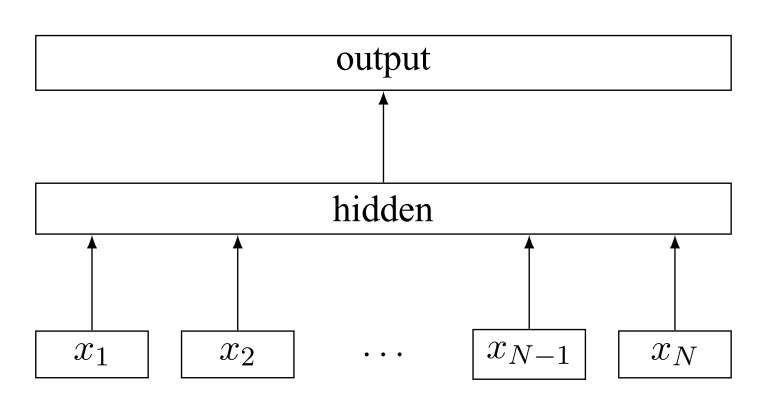
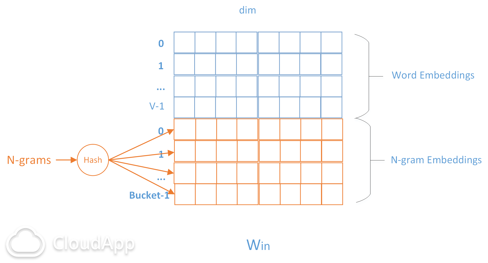

# FastText

FastText的模型结构如下：

主要有两个功能：

* **训练词向量（论文**Enriching Word Vectors with Subword Information**）**
* **文本分类（论文**Bag of Tricks for Efficient Text Classificatio**）**

## 训练词向量

 当训练词向量时，FastText可以看做**是基于Skip-gram模型改进的**。与原始的Skip-gram（用中心词预测上下文的词）相比，对于每一个单词的表示，它加入了这个单词的字符级别的ngram（或者说是这个词的subwords）的信息。

例如："hello"的字符级别的3-grams到4-grams的集合为 $$G_{hello}$$  = {\_he、hel、ell、llo、lo_、_\_hel、hell、ello、llo\_、\_hello\_}，注意：‘’\_‘’表示前缀或者后缀；且G集合中也包含单词本身。

**此时，上图模型中的** $$x_1、x_2...、x_N$$ **则表示输入单词t的** $$G_t$$ **，隐层为** $$h_t = \sum_{g\in G_t}\Phi_g$$ **，之后和Skip-gram的模型一样。**

**优点：**

* 对于低频词生成的词向量效果会更好。因为它们的n-gram可以和其它词共享。
* 对于训练词库之外的单词，仍然可以构建它们的词向量。我们可以叠加它们的字符级n-gram向量。
* 为了提高模型的效率，我们可以把前P个最高频率的单词直接用一个词向量表示，而不使用sum n-gram的方式表示。（P取的越小，计算量越大，效果越好。）

**最后的词向量为In the end, a word is represented by its index in the word dictionary and the value of the hashes of its n-grams，效果比SGNS要好。**

## 文本分类

当是文本分类时，FastText可以看做是**CBOW的变形**。

例如：“I love you.”的词级别的bigrams集合为 $$B_{hello}$$  = {&lt;SOS&gt; I 、I love、love you、you &lt;EOS&gt;}。

**此时，上图模型中的** $$x_1、x_2...、x_N$$ **则表示输入句子中的所有单词和单词的n-gram集合中的每一个n-gram。**

模型前向过程如下： $$h = \sum_i^Nx_i$$ ， $$y'=softmax(W_oh)$$ 。

如果类别比较多时，也可以使用层次softmax或者负采样来加速。

它和CBOW的区别主要在于：

1. fastText的输入为句子中的所有词和词的n-gram；（n可以自己设定）
2. 输出为fastText此时的输出为文本类别，不再是中心词。

综上所见，FastText其实是一个及其简单的模型，所以它的训练速度非常快，但它的效果却和其他深度模型的效果相当。

## Trick

具体实现上，由于n-gram的量远比word大的多，完全存下所有的n-gram也不现实。Fasttext采用了Hash桶的方式，把所有的n-gram都哈希到buckets个桶中，哈希到同一个桶的所有n-gram共享一个embedding vector。如下图所示：

图中Win是Embedding矩阵，每行代表一个word或N-gram的embeddings向量，其中前V行是word embeddings，后Buckets行是n-grams embeddings。每个n-gram经哈希函数哈希到0~bucket-1的位置，得到对应的embedding向量。用哈希的方式既能保证查找时O\(1\)的效率，又可能把内存消耗控制在O\(bucket×dim\)范围内。不过这种方法潜在的问题是存在哈希冲突，不同的n-gram可能会共享同一个embedding。如果桶大小取的足够大，这种影响会很小。

\[玩转FastText\][http://albertxiebnu.github.io/fasttext/](http://albertxiebnu.github.io/fasttext/)

