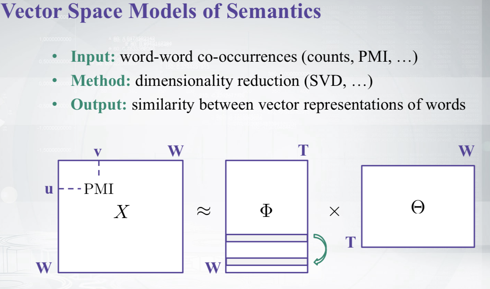
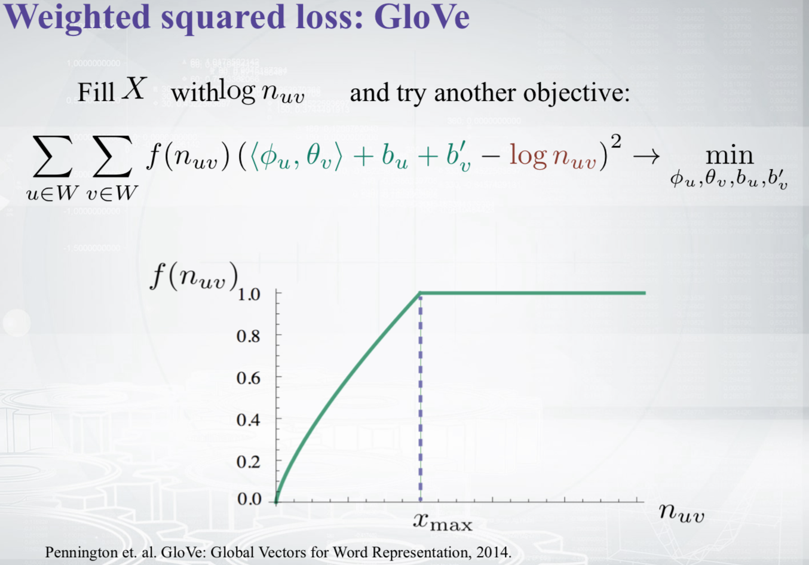
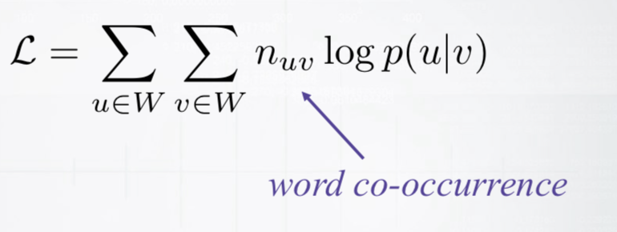
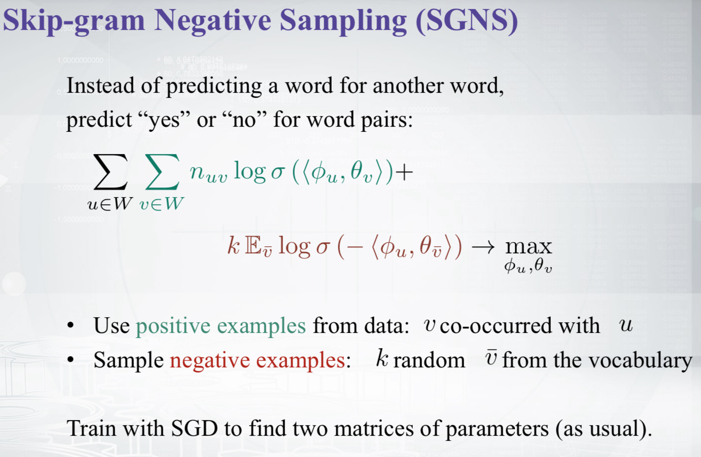
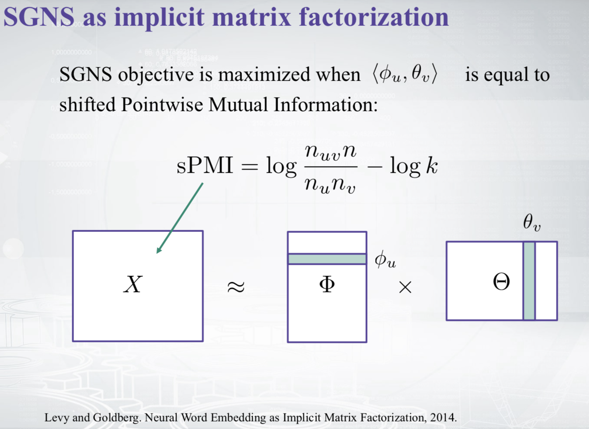

# GloVe

##  学习词向量的两种方法

学习词向量的两种主要方法分别为：

* **全局矩阵分解的方法：**如LSA、SVD等等
* **局部上下文窗口的方法：**如CBOW、Skip-gram

前者仅利用了全局统计信息，在word analogy任务上效果不如后者，意味着只达到了一个局部最优解；而后者在word analogy效果很好，但后者仅利用了局部上下文窗口内的统计信息，而没有使用全局统计信息。

其实两者都可以看做是**矩阵分解**的方法，只不过有的是显式的矩阵分解，有的是隐式的矩阵分解。

其中PMI\(Pointwise Mutual Information\)：

$$PMI = \log{\frac{p(u,v)}{p(u)p(v)}}=\log{\frac{n_{uv}n}{n_un_v}}$$ 

positive PMI，即 $$PPMI = \max(0,PMI)$$ 。

## GloVe模型

GloVe模型则结合了这两种方法，提出了一种加权最小二乘目标。GloVe是一种显式的矩阵分解方法。

最终我们的词向量为 $$\Phi+\Theta^T$$ 。

**而SGNS其实可以看做一种隐式的矩阵分解方法，**它间接地使用了基于窗口的统计信息。

SG的似然函数如下：

SGNS的似然函数如下：

SGNS经过变换之后可以得出：

SGNS是一种隐式的矩阵分解，它和GloVe的目标函数其实完全一样，只是它的X是由shift PMI填充得到的，而GloVe的X是由$$\log n_{uv}$$得到的。

