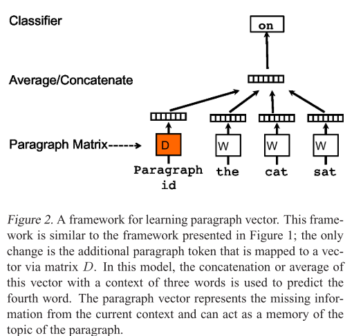
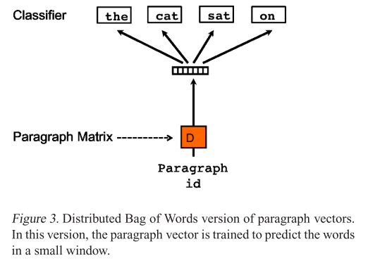
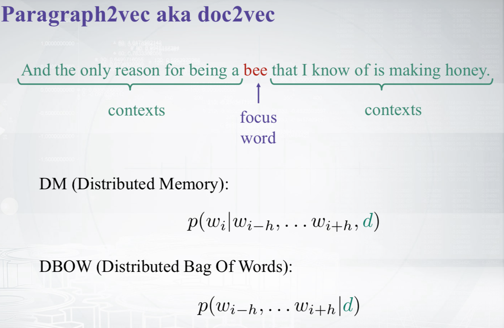

# Paragraph2Vec\(又称doc2vec\)

该算法将每个文档表示成一个向量，并被训练预测文档中的单词。

> More precisely, we concatenate the paragraph vector with several word vectors from a paragraph and predict the following word in the given context.

## PV-DM

**Paragraph Vector:A Distributed Memory Model.** 

它类似CBOW模型，模型结构如下：

Paragraph vector可以表示**当前上下文**缺失的信息或者看做是**当前段落的主题记忆**。

该算法有两个核心阶段：

* **训练阶段：**主要是为了得到段落向量D和词向量W，以及其他参数。
* **推导阶段：**为了得到新文档的段落向量，我们需要将新文档的向量加到D中，然后在保持W和模型其他参数不变的情况下，再次训练得到新的D，以此得到新文档的段落向量。

## PV-DBOW

**Paragraph Vector without word ordering: Distributed bag of words.**

它类似Skip-gram模型，模型结构如下：

> In our experiments, **each paragraph vector is a combinaion of two vectors**: one learned by the standard paragraph vector with distributed memory \(PV-DM\) and one learned by the paragraph vector with distributed bag ofwords \(PV- DBOW\). PV-DM alone usually works well for most tasks \(with state-of-art performances\), but its combination with PV-DBOW is usually more consistent across many tasks that we try and therefore strongly recommended.

一般会将PV-DM和PV-DBOW学到的两个段落向量的组合作为最终的段落向量。

## 总结

* PV-DM一般比PV-DBOW学到的段落向量更好，但没有两者结合起来好；
* PV-DM中使用concatenation 一般比sum要效果好；
* 最好通过交叉验证得到最佳的窗口大小；

