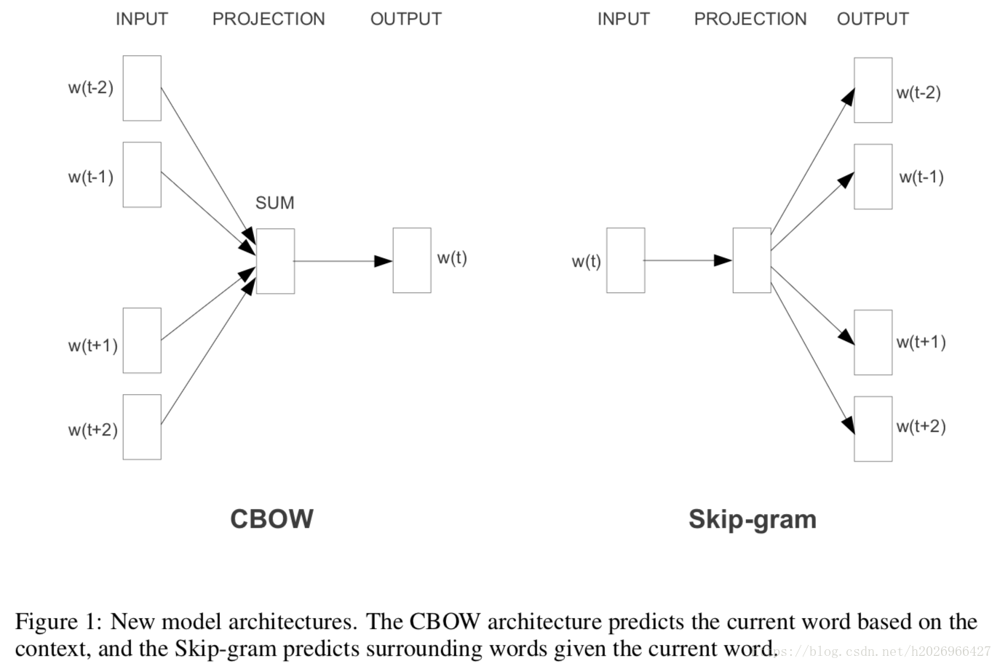
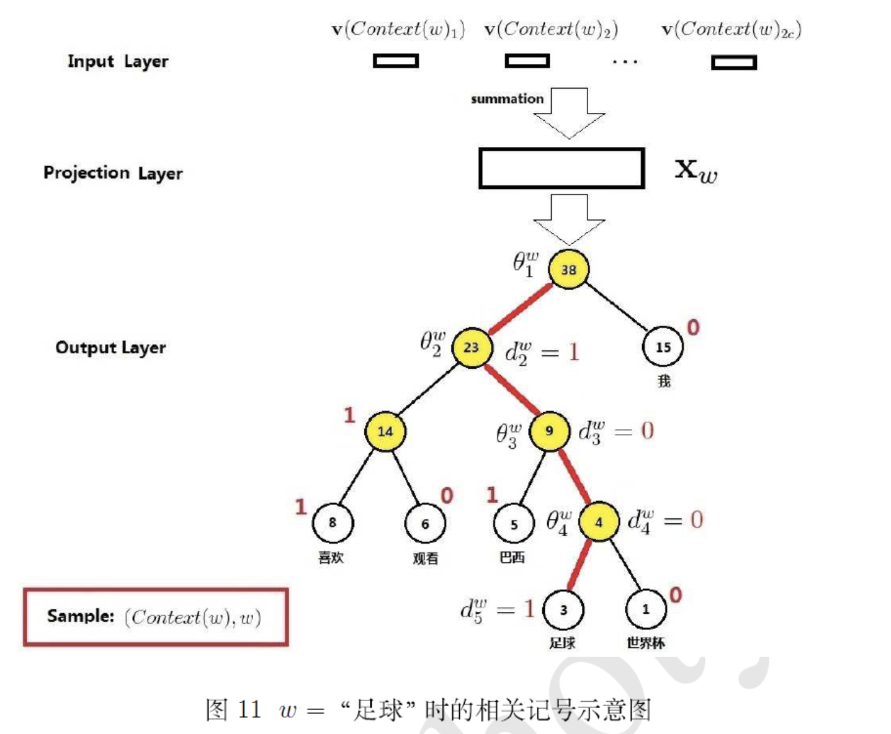
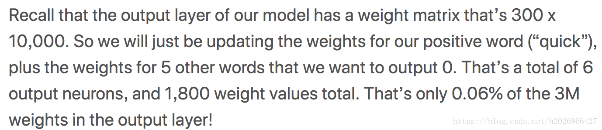

# Word2Vec

词向量的真正兴起，其实是从2013年Google的Word2Vec开始的。

一些字母表示：

T表示训练集中所有词的数量，C表示上下文的窗口大小，D表示词向量维度，V表示词典大小。

## 模型

### **1. CBOW**

**核心思想：**用上下文的多个词预测一个中心词。

**目标函数**： $$-\sum_{t=1}^{T}\log p(w_t|context(w_t))$$ ，其中：

$$p(w_t|context(w_t))=\frac{\exp(e'(w_t)^T*x)}{\sum_{i=1}^{V}\exp(e'(w_i)^T*x)}$$

$$x = context(w_t) = \frac{1}{2c}\sum_{-c\le j \le c,j \ne0}e(w_{t+j})$$

其中，e\(\)为输入词向量，e'\(\)为输出词向量；最后训练完成后，一般使用输入词向量作为真正的词向量。

**训练一个样本的复杂度为：** $$Q=2*W*D+D*\log_2(V)$$ 。其中，W表示上下文词的数量，D表示词向量维度，V表示词典大小。

### **2. Skip-gram**

**核心思想：**用一个中心词预测一个上下文的词。

**目标函数**： $$-\sum_{t=1}^{T}\sum_{-c\le j \le c,j\ne0}\log p(w_{t+j}|w_t)$$ ，其中：

$$p(w_{t+j}|w_t)=\frac{\exp(e(w_t)^T*e'(w_{t+j})}{\sum_{i=1}^{V}\exp(e(w_t)^T*e'(w_i))}$$ 

**训练一个样本的复杂度为：** $$Q=2*W*(D+D*\log_2(V)$$ 。其中，C表示Skip-gram要预测的上下文的词的数量，D表示词向量维度，V表示词典大小。

**CBOW对小型数据集比较合适，而Skip-gram在大型语料中表现得更好。**

### **3. Trick**

* **高频词的下采样subsampling（也称二次采样）**

一般高频词都没有什么意义，而低频词的意义却很大。所以为了**得到更好的词向量**，可以以一定的概率丢弃高频词，一个词的频率越高，被丢弃的概率就越大。被丢弃的概率如下： $$p(w_i) = 1-\sqrt{\frac{t}{f(w_i)}}$$ ，其中t一般取 $$10^{-5}$$，为一个词被丢弃的阈值，只有超过这个阈值，才会被丢弃。

而且，它**也可以加快训练速度**，因为通过丢弃一定的高频词，也相应地减少了很多低质量的训练样本。

### 4，与NNLM的比较

Word2Vec和NNLM不一样本质区别在于：

**NNLM的主要任务是要学习一个解决语言模型任务的网络结构，语言模型就是要看到上文预测下文，而word embedding只是无心插柳的一个副产品。但Word2Vec目标不一样，它单纯就是要word embedding的，这是主产品，所以它完全可以随性地这么去训练网络。**

## 加速方法

### 1. 层次Softmax

**本质：将V分类问题变成了log\(V\)次的二分类问题。**

例如CBOW的层次Softmax版，如下图所示：

**最后不再需要Softmax函数来计算** $$p(w_t|context(w_t))$$ ，**取而代之的是利用目标词的Huffman code（即路径）经过的几次sigmoid函数（即二分类）乘积来计算** $$p(w_t|context(w_t))$$ **，这样极大地提高了计算的速度。**

**Q1: 为什么要使用Huffman tree?**

**A1:**构造Huffamn tree的时候是依照每个词的频率来构造的，这样高频词的深度就浅一些，需要更新的参数相比于使用完全二叉树来说就更少一些。当高频词的频率很高时，相比于使用完全二叉树，使用Huffman tree就更高效，而且也更省内存。

**Q2:当使用层级Softmax后，还有输出词向量吗？**

**A1:没有输出词向量了，只有输入词向量。因为输出层不再使用softmax，而是Huffman tree，每一层代表一次logistic回归，即二分类。**

### 2. 负采样

**本质：预测总体类别的一个子集。**

每次用一个训练样本，就要更新所有的权重，这显然对于有大量参数和大量样本的模型来说，十分耗费计算量。但其实每次用一个训练样本时，我们并不需要更新全部的参数，我们只需要更新那部分与这个样本相关的参数即可。**而负采样的思想就是每次用一个训练样本更新一小部分参数。负采样的意思是每次用的那个训练样本最后输出的值其实只有一个词的值是1，而其他不正确的词都是0，我们可以从那些是0的单词中采样一部分如5~20词来进行参数更新，而不使用全部的词。**

负采样是NCE的一个简化版，NCE认为一个好的模型应该能通过logistic回归区分数据和噪声。负采样和NCE的区别在于，负采样只需要噪声的样本就行，而NCE不仅需要噪声的样本还需要噪声的概率分布。

它不仅能够加快训练速度，而且还能提高词向量的质量。

与层次Softmax相比，负采样不用构建复杂的Huffman tree，而只是利用随机的负采样，能大幅提高性能。

例如**Skip-gram的负采样版本的目标函数将变成**：

$$-\sum_{t=1}^{T}\sum_{-c\le j \le c}\log g(w_{t+j},w_t)$$ ，其中：

$$g(w_{t+j},w_t)=\sigma(e(w_t)^T*e'(w_{t+j}))*\prod_{w\in NEG(w_{t+j})}[1-\sigma(e(w_t)^T*e'(w))]$$ 

**其核心就是增大正样本的概率，同时降低负样本的概率。**

负采样是带权重采样，一般会将权重分布平滑一下。负采样的采样的样本个数k的取值：

* 小数据集时，k一般取5~20；
* 大数据集时，k一般取2~5。

**普遍认为层次Softmax对低频词效果较好；负采样对高频词效果较好，向量维度较低时效果更好。**

## 优点

Word2Vec之所以这么出名，主要是因为：

* **训练速度非常快**
* **更好的灵活性：加入新文档、新句子，词表里加入新词。**

## 参考

\[Word2Vec的数学原理详解\]\([https://www.cnblogs.com/peghoty/p/3857839.html](https://www.cnblogs.com/peghoty/p/3857839.html)

\[知乎\][https://zhuanlan.zhihu.com/p/26306795](https://zhuanlan.zhihu.com/p/26306795)



